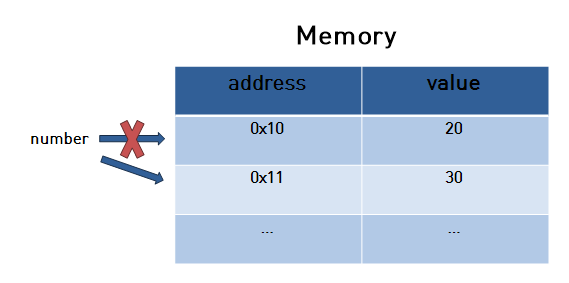
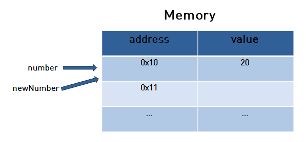
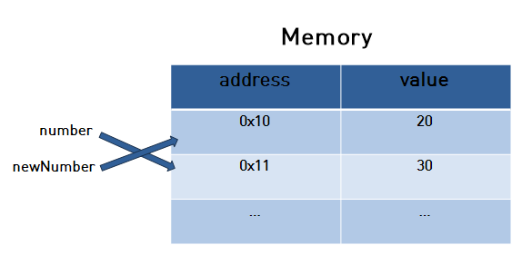
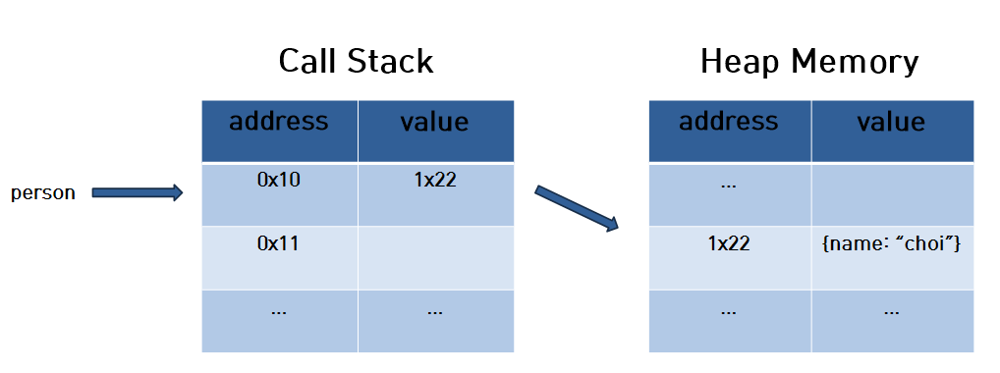
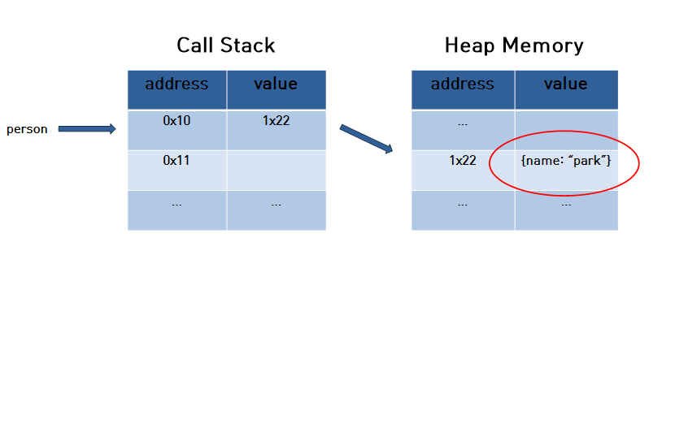
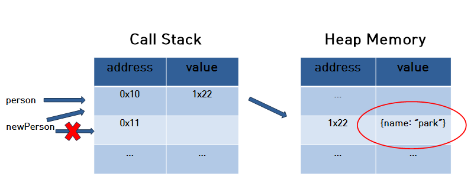
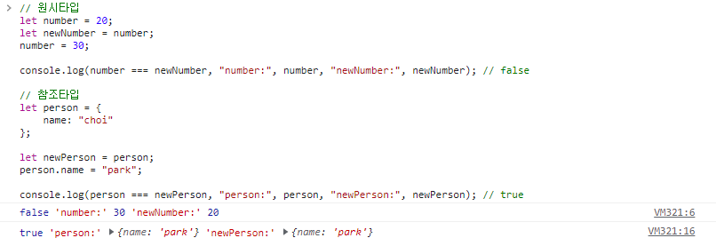
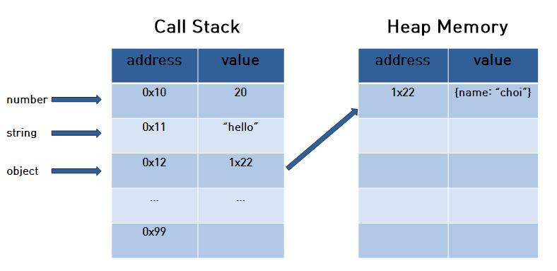

# Javascript의 원시값과 참조값

## 개요

자바스크립트를 사용하면서, 당연하게 사용되던 타입들에 대해 조금 더 제대로 알고 사용 하고자 하며, 당연하게 사용되는 부분들에 대해 기본적이지만 아주 중요성을 느껴 자바스크립트의 원시값과 참조값에 대해 작성하고자 한다.

자바스크립트의 데이터 타입은 2가지로 분류된다.

***원시타입*** 그리고 ***참조타입*** 이다.

그렇다면 원시타입과 참조타입은 어떠한 타입들로 분류 되어있으며, 메모리는 어떻게 활용되고 있는지 알아보도록 하자.

### 원시타입

원시타입은 우리가 흔히 쓰는 string, number, boolean, null, undefined, 그리고 ES6에서 추가된 symbol 타입으로 구분된다.

여기서 symbol 타입은 다소 다른 원시타입들과 비교하면 생소하게 느껴질 수 있다.

이 포스트에서는 원시타입과 참조타입에 대한 내용을 주로 다룰 것이므로, symbol타입에 대해서는 정말 간단히 알고만 가자.

#### symbol type

심볼(symbol)은 ES6에서 새롭게 추가된 7번째 타입으로 변경 불가능한 원시 타입의 값이다. 심볼은 주로 이름의 충돌 위험이 없는 유일한 객체의 프로퍼티 키(property key)를 만들기 위해 사용한다.

#### symbol의 생성

``` js
// 심볼 mySymbol은 이름의 충돌 위험이 없는 유일한 프로퍼티 키
const mySymbol = Symbol('test');

console.log(mySymbol);        // Symbol(test)
console.log(mySymbol === Symbol('test')); // false
```

Symbol() 함수는 String, Number, Boolean과 같이 래퍼 객체를 생성하는 생성자 함수와는 달리 new 연산자를 사용하지 않는다.

그렇다면, string, number, boolean 등등의 타입을 지닌 원시타입은 어떠한 속성을 가지고 있을까?

### 원시타입의 값

- 원시 타입의 값은 변경 불가능한 값이다. 한번 생성된 원시 타입의 값은 읽기 전용으로 값을 변경 할 수 없다.
- 원시 값은 변수에 할당하면 변수에는 실제 값이 저장된다.

여기서 궁금한 점이 있다.

"원시 타입은 변경이 불가능 하다" 라는 내용을 보자

우리는 자바스크립트를 쓸 때, 한번 변수에 데이터를 저장하고, 그 저장한 값을 바꾸는데 왜 변경이 불가능 하다고 하는 것일까?

```js
let number = 20;

number = 30;
```

이렇게 값을 변경 시킬 수 있는 것이 아닌가?

변경불가능한 값의 의미는 이렇게 정리 할 수 있을 것이다.

- 원시값을 할당한 변수는 원시값 자체를 값으로 가진다.
- 변수에 재할당이 불가능 하다는 의미가 아니고, 메모리에 할당된 값이 변경되지 않는 다는 것이다.

아래의 그림을 살펴보면 더 이해하기 쉬울 것이다.


처음 number 이라는 변수에 20이라는 값으로 초기화 했을 때 그림은 위와 같다.

0x10이라는 주소에 20이라는 값을 메모리에 저장한다.

여기서 number 변수를 30으로 변경 한다는 것은, 해당 0x10 주소에 20값을 30으로 변경 하는 것이 아니고 다음 그림과 같이 수행 되는 것이다.



위와 같이 그림을 보면 이해하기가 훨씬 쉬울 것이다.

그렇다면 다음과 같이 새로운 변수를 number이라는 변수 값으로 초기화 하면 메모리 상으로 어떻게 될까?

```js
let number = 20;

let newNumber = number;
```

위와같을 때에는 newNumber는 number와 같은 메모리의 주소를 가르키게 되는 것이다.



그렇다면 여기서 조금 더 나아가서 다음과 같이 입력되면 어떻게 될까?

```js
let number = 20;

let newNumber = number;

number = 30;
```

number과 newNumber의 값이 같을까?

당연히 같지 않다.

여기서, number과 newNumber은 20이라는 같은 주소를 가르키고 있지만, number을 30으로 변경 했을 때, 메모리는 다음과 같이 될 것이다.



위 그림을 보자면, 처음에는 같은 0x10 이라는 주소를 같이 가르키고 있었지만, number를 30으로 변경 했을 때, 0x11이라는 주소에 30이라는 값이 저장되어 number는 0x11의 주소를 가르키게 된다.

이렇게 원시 값이란, 메모리 상으로 보았을 때 해당 주소에 저장되어 있는 값을 변경 시킬 수 없기에 변경 불가능 한 값(immutable) 이라고 말한다.

원시 타입에 대한 내용을 알아보았으니 이제 참조타입에 대해 알아보자.

### 참조타입

참조타입은 Array, Object, Function 타입으로 구분된다.

### 참조타입의 값

- 참조타입의 값은 변경 가능한 값이다.
- 참조값을 변수에 할당하면, 변수에는 참조 값이 저장된다.

원시타입에서는, 변수에 값을 할당하면 메모리에서는, 주소와 값이 저장되었지만, 참조타입에서는 주소와, 객체가 저장된 메모리 주소가 저장된다. 이를 참조값이라고 부르는데, 이것 또한 더 쉽게 이해를 하기 위해서 다음과 같이 그림으로 살펴보자

우선 person이라는 변수에, 다음과 같이 object의 타입으로 선언 하였다.

```js
let person = {
    name: "choi";
}
```



위의 이미지를 보면 원시타입과 다르게 CallStack과 HeapMemory가 추가 된 것을 볼 수 있다. CallStack과 HeapMemory에 대해서는 조금 있다가 알아보자.

우선, person이라는 변수를 위와 같이 선언 하였을 때, 메모리는 이미지와 같이 실행된다.

person이라는 변수가 생성 되었을 때, 0x10이라는 주소에 바로, value가 생성 되는 것이 아니라, heapMemory의 주소를 가르킨다.

여기서 heapMemory는 실제로 person이라는 변수의 데이터를 저장하고 있다.

그렇다면 변경가능한 값이란 무엇을 의미하는 것일까?

코드와 이미지를 보자.

```js
let person = {
    name: "choi"
}

person.name = "park";
```



이미지를 보면 알 수 있듯이, 원시타입과 다르게 새로운 주소와 값이 생성 되는 것이 아니라, 기존에 할당된 주소의 Value의 값을 바꾸는 것이다.

기존에는 `{name: "choi"}` 에서 `{name: park}` 으로 변경 되었다.

그렇다면 새로운 변수에, person을 할당하여, 기존의 person이라는 변수를 변경하면 어떻게 될까?

```js
let person = {
    name: "choi"
};

let newPerson = person;
person.name = "park";
```



이미지를 보자면, newPerson은 person과 같은 주소를 가르키게 되고, Heap Memory에서 person에 대한 새로운 address와 value가 생기는 것이 아니라, 기존의 address에 값을 변경 시키게 되는 것이다.

그러면, person의 값과 newPerson의 값이 같을까?

이에 대한 답을 알아보기 전, 원시타입은 어떻게 동작 하였는가?

위에서도 설명 하였듯이, number와 newNumber이 있고 number의 값만 변경 했을 때에는, 새로운 주소와 값을 가르키게 되어, 이는 값이 다르게 되었다.

하지만, 참조 타입은, 값이 변하게 되어도 새롭게 주소가 생기는 것이 아니고, 기존 주소에 값만 변경되는 것이기 때문에, person과 newPerson의 값이 같게 되는 것이다.

그러면 콘솔로 직접 값을 입력하여, 확인해보자.

```js
// 원시타입
let number = 20;
let newNumber = number;
number = 30;

console.log(number === newNumber, "number:", number, "newNumber:", newNumber); // false

// 참조타입
let person = {
    name: "choi"
};

let newPerson = person;
person.name = "park";

console.log(person === newPerson, "person:", person, "newPerson:", newPerson); // true
```



지금 까지, 자바스크립트의 데이터 타입인 원시타입과 참조타입에 대해 알아 보았다.

그러면, 참조타입에 대한 내용을 들어오면서 메모리에 대한 이미지를 보면, Call Stack과 Heap Memory가 추가 된 것을 볼 수 있는데, 이제 이에 대한 내용을 알아보자.

## 콜스택, 힙 메모리란 무엇일까?

자바스크립트는 콜스택과 메모리힙이라는 메모리 구조를 통해 데이터 및 코드 실행을 관리한다.

### 콜스택

콜스택은 원시타입(String, Number, Boolean ...)의  데이터가 저장되는 메모리를 말한다.

실행 컨텍스트를 통해 변수 식별자 저장, 스코프 체인 및 this 관리, 코드 실행 등을 수행 한다.

실행컨텍스트에 대한 내용은 진짜로, 해당 포스트의 주제의 범위를 벗어나기 때문에 다른 포스트에서 다루도록 할 것이다.

### 힙 메모리

힙 메모리란, 참조타입 (Array, Object, Function)의 데이터가 저장되는 메모리를 말한다.

구조를 보면, 위에 참조타입의 구조와 같지만, 위의 구조는 참조타입의 데이터만 다루고 있어, 원시타입과 참조타입 함께 메모리에 어떻게 구성되는지 알아보자.

우선 코드는 다음과 같다.
이해하기 쉽도록 편의상 변수 명은 타입으로 지정할 것 이다.

```js
let number = 20; // 원시타입
let string = "hello"; // 원시타입
let object = {
    name: "choi"
}
```

위와 같이 변수가 선언되어있으면 메모리 구조는 다음처럼 구성될 것이다.



콜스택을 보면 앞서 설명한 것과 같이, 원시타입에 대한 값이 저장되어있다.
힙메모리에는 참조타입의 값이 저장되어 있고, 콜스택은 해당 힙메모리의 주소를 가르키고 있다.

### 마치며

이번에는 자바스크립트의 데이터 타입인 원시타입과 참조 타입에 대해 알아보았으며,
실제로 메모리에서 어떻게 동작하고 있는지와, 콜스택과 힙메모리에 대해서도 알아보았다.
