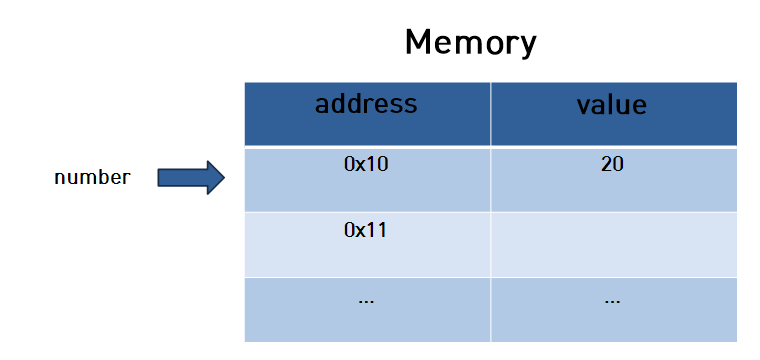

# Javascript의 원시값과 참조값

## 개요

자바스크립트를 사용하면서, 당연하게 사용되던 타입들에 대해 조금 더 제대로 알고 사용 하고자 하며, 당연하게 사용되는 부분들에 대해 기본적이지만 아주 중요성을 느껴 자바스크립트의 원시값과 참조값에 대해 작성하고자 한다.

자바스크립트의 데이터 타입은 2가지로 분류된다.

***원시타입*** 그리고 ***참조타입*** 이다.

그렇다면 원시타입과 참조타입은 어떠한 타입들로 분류 되어있으며, 메모리는 어떻게 활용되고 있는지 알아보도록 하자.

### 원시타입

원시타입은 우리가 흔히 쓰는 string, number, boolean, null, undefined, 그리고 ES6에서 추가된 symbol 타입으로 구분된다.

여기서 symbol 타입은 다소 다른 원시타입들과 비교하면 생소하게 느껴질 수 있다.

이 포스트에서는 원시타입과 참조타입에 대한 내용을 주로 다룰 것이므로, symbol타입에 대해서는 정말 간단히 알고만 가자.

#### symbol type

심볼(symbol)은 ES6에서 새롭게 추가된 7번째 타입으로 변경 불가능한 원시 타입의 값이다. 심볼은 주로 이름의 충돌 위험이 없는 유일한 객체의 프로퍼티 키(property key)를 만들기 위해 사용한다.

#### symbol의 생성

``` js
// 심볼 mySymbol은 이름의 충돌 위험이 없는 유일한 프로퍼티 키
const mySymbol = Symbol('test');

console.log(mySymbol);        // Symbol(test)
console.log(mySymbol === Symbol('test')); // false
```

Symbol() 함수는 String, Number, Boolean과 같이 래퍼 객체를 생성하는 생성자 함수와는 달리 new 연산자를 사용하지 않는다.

그렇다면, string, number, boolean 등등의 타입을 지닌 원시타입은 어떠한 속성을 가지고 있을까?

### 원시타입의 값

- 원시 타입의 값은 변경 불가능한 값이다. 한번 생성된 원시 타입의 값은 읽기 전용으로 값을 변경 할 수 없다.
- 원시 값은 변수에 할당하면 변수에는 실제 값이 저장된다.

여기서 궁금한 점이 있다.

"원시 타입은 변경이 불가능 하다" 라는 내용을 보자

우리는 자바스크립트를 쓸 때, 한번 변수에 데이터를 저장하고, 그 저장한 값을 바꾸는데 왜 변경이 불가능 하다고 하는 것일까?

```js
let number = 20;

number = 30;
```

이렇게 값을 변경 시킬 수 있는 것이 아닌가?

변경불가능한 값의 의미는 이렇게 정리 할 수 있을 것이다.

- 원시값을 할당한 변수는 원시값 자체를 값으로 가진다.
- 변수에 재할당이 불가능 하다는 의미가 아니고, 메모리에 할당된 값이 변경되지 않는 다는 것이다.

아래의 그림을 살펴보면 더 이해하기 쉬울 것이다.



처음 number 이라는 변수에 20이라는 값으로 초기화 했을 때 그림은 위와 같다.

0x10이라는 주소에 20이라는 값을 메모리에 저장한다.

여기서 number 변수를 30으로 변경 한다는 것은, 해당 0x10 주소에 20값을 30으로 변경 하는 것이 아니고 다음 그림과 같이 수행 되는 것이다.


위와 같이 그림을 보면 이해하기가 훨씬 쉬울 것이다.

그렇다면 다음과 같이 새로운 변수를 number이라는 변수 값으로 초기화 하면 메모리 상으로 어떻게 될까?

```js
let number = 20;

let newNumber = number;
```

위와같을 때에는 newNumber는 number와 같은 메모리의 주소를 가르키게 되는 것이다.


그렇다면 여기서 조금 더 나아가서 다음과 같이 입력되면 어떻게 될까?

```js
let number = 20;

let newNumber = number;

number = 30;
```

number과 newNumber의 값이 같을까?

당연히 같지 않다.

여기서, number과 newNumber은 20이라는 같은 주소를 가르키고 있지만, number을 30으로 변경 했을 때, 메모리는 다음과 같이 될 것이다.


위 그림을 보자면, 처음에는 같은 0x10 이라는 주소를 같이 가르키고 있었지만, number를 30으로 변경 했을 때, 0x11이라는 주소에 30이라는 값이 저장되어 number는 0x11의 주소를 가르키게 된다.

이렇게 원시 값이란, 메모리 상으로 보았을 때 해당 주소에 저장되어 있는 값을 변경 시킬 수 없기에 변경 불가능 한 값(immutable) 이라고 말한다.

