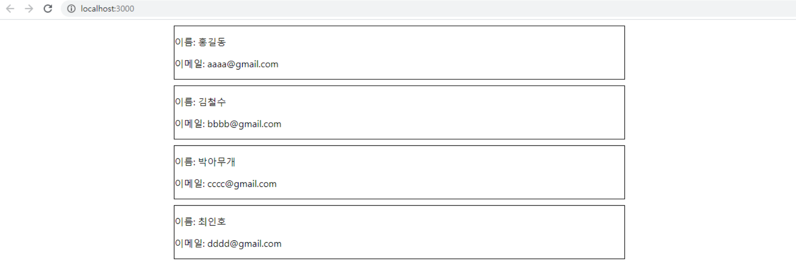

# map 함수를 사용한 배열 랜더링 하기

### 개요

배열을 다룰때 사용하는 Javascript의 내장 함수인 map에 대하여 알아보고, 어떻게 활용하는지에 대해 알아보자.

먼저, Javascript의 Array.map 에 대한 내용에 대해 간단하게 알아 본 후, 예제를 통해 리액트에서 어떻게 활용하는지 다루어 보겠다.

### map 함수란?

map() 함수란, 배열 내의 모든 요소 각각에 대하여 주어진 함수를 호출한 결과를 모아 새로운 배열을 return 하는 함수이다.
이 개념에 대해 햇갈릴 수 있지만, 다음 예제를 보고 보다 쉽게 이해해보자.

```js
const data = [1, 3, 5, 7, 9];

// map 함수
const mapData = data.map((item) => item * 2);

console.log(mapData); // 2, 6, 10, 14, 18
```

어떻게 출력되시는지 한번 확인해보자.

2, 6, 10, 14, 18이 출력 되면 정상적으로 map함수가 작동하는 것을 볼 수 있다.

이렇게, map함수는 각각의 요소에 대해 한번씩 순서대로 불러 그 함수를 반환하는 새로운 배열을 만드는 것이다.
위와 같이 각각의 요소에 대해 2를 곱한 값하여 반환하여 mapData는 data의 2를 곱한 값의 배열을 가지게 된다.

이제 map 함수에 대해 간단하게 알아 보았고. 이 map 함수를 사용하여 리액트에서 어떻게 활용하는지 알아보자.

### Array.map 활용해보기

map 함수를 사용하기 전, map 함수를 사용하지 않으면 어떻게 되는지 알아보자.

```js
import React from "react";

class List extends React.Component {
  render() {
    return (
      <div>
        <ul>
          <li>1</li>
          <li>2</li>
          <li>3</li>
          <li>4</li>
          <li>5</li>
          <li>6</li>
        </ul>
      </div>
    );
  }
}

export default List;
```

위와 같이 코드를 작성하면 map 함수를 사용하지 않고 간단하게 만들 수 있지 않을까? 라고 생각하는사람은 없겠지만, 있다고 해보자.

만약 li 태그가 100개 이상이 필요한 상황이라고 가정 해보면,
li 태그를 1부터 100까지 100개를 만들어 주어야 한다.

너무 비효율 적이다.

배열의 길이 만큼 코드를 반복해야하기 때문에, 효율적으로 map함수를 사용 한다.

그렇다면, 프로그래밍을 배운 사람이라면, 반복문은 for문으로 하면 되지 않을까? 라고 생각할 수 도있다.

for문으로도 map과 같이 반복을 수행하여 보다 쉽게 View를 나타낼 수 있다.

여기서는 for문과 map에 대해서 자세히 다루지 않을 것이지만, 간단하게 차이점을 보자면 다음과 같다.

#### for문과 map()의 차이

가장 큰 차이는, return의 차이이다.

for문은 단순하게 1부터 n까지의 반복을 시켜 데이터를 처리하는 방식이라면, map()은 해당 배열의 길이만큼 반복을 하고 새 값으로 return 한다는 것이다.

그럼 위의 코드와 동일한 결과가 나오도록 map함수를 활용하여 예제를 만들어 보자.

#### src/components/List

```js
import React from "react";

class List extends React.Component {
  render() {
    const data = [1, 2, 3, 4, 5, 6]; //추가
    return (
      <div>
        <ul>
          {data.map((item) => (
            <li>{item}</li>
          ))}
          //변경
        </ul>
      </div>
    );
  }
}

export default List;
```

data라는 배열을 만든 후, map을 이용하여, 간단하게 컴포넌트에 적용해보았다.

이 예제가 잘 작동하는지, 브라우저로 확인해보고, 제대로 나오지 않는다면, 코드를 잘못 작성한 것이다.

화면상에는 문제없이 잘 나오지만, 콘솔창을 열어보자.

그럼 다음과 같은 에러메세지를 확인할 수 있다.

```js
Warning: Each child in a list should have a unique "key" prop.
```

### Key

> key는 Element 리스트를 만들 때 포함해야 하는 특수한 문자열 어트리뷰트 이다.

key는 리액트가 어떤 아이템에 대한 변경, 추가, 삭제 되었는지에 대한 인식을 하는데 도움을 준다.
그렇기에 요소에 안정적인 ID를 제공하려면 배열 내부 요소에 key를 주어야 한다.

만약 key값은 중복되는 값을 key로 넣었을 경우에도 에러메세지를 확인 할 것이다.

반드시 key값은 중복되지 않는 값으로 입력하자.

```js
import React from "react";

class List extends React.Component {
  render() {
    const data = [1, 2, 3, 4, 5, 6];
    return (
      <div>
        <ul>
          {data.map((item) => (
            <li key={item}>{item}</li>
          ))}
          //key 추가
        </ul>
      </div>
    );
  }
}

export default List;
```

위와 같이, data라는 배열 안에 중복되지 않는 값으로 입력 되었으므로, 에러메세지는 나지 않을 것이다.

만약 data가 [1, 1, 2, 3, 4, 5, 6] 으로 선언 되었다면 다음과 같은 에러가 발생한다.

```js
Warning: Encountered two children with the same key, `1`. Keys should be unique so that components maintain their identity across updates. Non-unique keys may cause children to be duplicated and/or omitted — the behavior is unsupported and could change in a future version.
```

그렇기에 반드시, map함수를 사용하여, 리스트를 생성한다면, 각자 고유의 key 값을 지정해 줘야한다.

만약에 반드시 배열안에 동일한 값이 저장되어 있다면 어떻게 할까?

다음과 같이 코드를 작성하면 된다.

```js
{
  data.map((item, index) => <li key={index}>{item}</li>);
}
```

차이점은 item이라는 요소뒤에 index라는 값을 추가하는 것이다.

item이라는 요소 뒤에, index는 반드시 index로 입력되는 것이아니라, i, key 등 다양하게 사용할 수 있다.

이 index는 0부터 시작해서, 배열의 마지막 length로 끝이 난다.

```js
const arr = [1, 3, 1, 8, 11, 33, 500, 6, 7];

arr.map((item, index) => {
  console.log(`item = ${item}, index = ${index}`);
});

// 결과 :
// item = 1, index = 0
// item = 3, index = 1
// item = 1, index = 2
// item = 8, index = 3
// ...
```

Array.map 에 대하여, 간단하게 알아보았다.
이를 활용하여 간단한, 이메일 주소록을 만들어 보자.

```js
import React from "react";

class List extends React.Component {
  render() {
    //list
    const data = [
      { id: 0, name: "홍길동", email: "aaaa@gmail.com" },
      { id: 1, name: "김철수", email: "bbbb@gmail.com" },
      { id: 2, name: "박아무개", email: "cccc@gmail.com" },
      { id: 3, name: "최인호", email: "dddd@gmail.com" },
    ];

    // CSS-in-JS
    const style = {
      border: "1px solid",
      margin: "10px 300px",
    };

    return (
      <div>
        // map 활용
        {data.map((item) => (
          <div key={item.id} style={style}>
            <p>이름: {item.name}</p>
            <p>이메일: {item.email}</p>
          </div>
        ))}
      </div>
    );
  }
}

export default List;
```

제대로 화면에 나오는지 확인해보자.



위의 이미지와 같이 화면에 보인다면 정상적으로 작동하고 있다는 것이다.

위의 코드를 간단히 설명하자면, data라는 변수에, 위와 같이 객체 배열로 생성 하였다.

id값은 각 Element 마다의 고유 값을 나타내며, 중복이 되면 안된다.

그리고 map함수를 사용하여, data의 id값으로 key값을 지정 하였다.

### 마치며

javascript의 내장함수인 map을 활용하여 리액트에서 배열을 다루는 방법에 대해 알아보았다.

정말로 간단하게 다루었지만, 위의 예제코드와 같은 기본적인 방식으로, map은 활용이 된다.

map()을 사용할때에는 중복되지 않는 값으로 key를 설정하고, for/foreach와는 다르게, 새 배열로 return 한다는 점을 까먹지말자.
