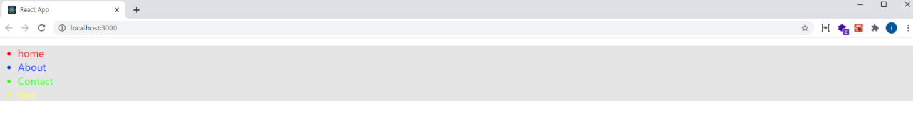

# Styled-components 적용하기

### 개요

React 개발하면서 스타일을 위해 사용되는 Styled-component에 대한 개념 및, 사용법에 대해 알아보겠다.

화면에 대한 스타일링 방식은 다양하게 존재하며, 사용법이 다르다.
styled-component에 대한 설명을 하기 전에, 간단하게 css, sass, css-in-js 에 대한 내용을 짚고 넘어가자.

### CSS

css는 스타일링에 있어 가장 기본적인 방식이다.

또한, css는 이해하기가 매우 쉬우며, 추가적인 플러그인이 필요없이, 간단하게 사용할 수 있다.

하지만 CSS 문법을 작성하는데 몇몇의 문제점이 있다.

- 클래스명에 대한 고민 (클래스명 중복을 피하기 위해 네이밍 필요)
- 작성방법이 자유로워, 정해진 가이드가 없으면 구조가 복잡해짐
- 코드의 가독성이 떨어짐

이러한 문제들을 해결하기 위해 SASS라는 문법이 생겼다.

### Scss(Sass)

Sass는css pre-processor(전처리기)로, css의 여러 문제점들을 해결하기 위해 나타난 문법으로, 복잡한 작업을 쉽게하고, 코드의 재활용성을 높여줄 뿐만 아니라, 가독성을 높여, 유지보수를 더 쉽게 할 수 있도록 한다.

> **전처리기**는 scss(sass)의 스타일 정보를 작성할 시, 컴파일을 통해 css 문법으로 전환되는 과정을 거침

Sass 에서는 두가지 확장자(.scss / .sass)를 지원 한다.

주로, Sass 보다 Scss의 문법이 더 많이 사용되고, 더욱 친숙하게 느껴질것이다.
그럼 Scss는 또 다른 개념인가? 라고 생각 할 수 있지만, 비슷하다.

쉽게 말하면, Scss는 css의 문제를 해결하기위한 Sass 기능을 사용 하면서, 기존의 css의 문법과 호환되도록 하는 문법 이다.

그러면 간단히, Sass와, Scss의 문법차이를 확인해 보자.

##### .sass

```js
$font-stack:    Helvetica, sans-serif
$primary-color: #333

body
  font: 100% $font-stack
  color: $primary-color
```

##### .scss

```js
$font-stack:    Helvetica, sans-serif;
$primary-color: #333;

body {
  font: 100% $font-stack;
  color: $primary-color;
}
```

위와 같은 차이가 있으며, 개인적으로는 Scss가 더 친숙하다.

이와같이 Scss(Sass)와 같은 문법이 생겨, 가독성이 많이 보완되고, 디버깅이 용이해져, 많이 사용되는 스타일링 기법으로 자리 잡았다.

#### scss 간단한 예제

새로운 리액트 프로젝트를 설치하여 진행해보자.

scss문법을 사용하기 위해서는 node-sass 라이브러리를 설치해야한다.

```js
npm install node-sass
```

설치가 완료 되었다면, src에 components 폴더를 만들고, StyleComponent.scss 파일을 다음과 같이 만들어보자.

##### src/components/StyleComponent.scss

```css
$red: #ff0000;
$blue: #0033ff;
$green: #33ff00;
$yellow: #ffff00;

.wrap {
  background-color: #e5e5e5;
  ul {
    .list {
      font-size: 20px;
      cursor: pointer;
      &:hover {
        font-size: 26px;
      }
      &.red {
        color: $red;
      }
      &.blue {
        color: $blue;
      }
      &.green {
        color: $green;
      }
      &.yellow {
        color: $yellow;
      }
    }
  }
}
```

StyleComponent.js 파일도 만들자.

##### src/components/StyleComponent.js

```js
import React from "react";
import "./StyleComponent.scss"; //추가
class StyleComponent extends React.Component {
  render() {
    return (
      // 추가
      <div className="wrap">
        <ul>
          <li className="list red">home</li>
          <li className="list blue">About</li>
          <li className="list green">Contact</li>
          <li className="list yellow">Test</li>
        </ul>
      </div>
    );
  }
}

export default StyleComponent;
```

그리고 해당 컴포넌트를 App.js 컴포넌트에서 렌더링 한다.

##### src/App.js

```js
import StyleComponent from "./components/StyleComponent"; //추가

function App() {
  return (
    <div className="App">
      <StyleComponent /> //추가
    </div>
  );
}

export default App;
```

이제 브라우저에서 확인해 보자.



위의 이미지와 같이 잘 보이는가?
잘보면 scss가 정상적으로 작동 된 것이다.

이처럼 변수를 활용하거나 Mixin 등의 기능이 존재하며, 가독성이 많이 보완 되었지만, 여전히 클래스명에 대한 고민이 있다.

이런 클래스명에 대한 문제를 해결하기 위한 styled-components 에 대해 알아보자.

### styled-components

styled-component는 리액트의 CSS-in-JS 관련 라이브러리 중에 가장 많이 사용되고 있는 라이브러리 이다

이름에서 보듯이, CSS-in-JS 는 자바스크립트 파일 내부에 CSS를 작성하는 기법으로, 많은 곳에서 사용하고 있다.

**styled-component**의 주요 특징은 다음과 같다.

- Css및 Scss(Sass)와 같이 클래스명에 대한 고민하는 문제를 덜어준다.
- styled-component는 하나의 자바스크립트 파일안에 스타일까지 작성하기 때문에 .css / .scss 와 같은 파일을 만들지 않아도 된다.
- styled-component는 UI단위를 나누어 컴포넌트화 하듯, 스타일을 컴포넌트화 하여 재사용 가능하도록 만들 수 있다.

그럼 이제 styled-component를 사용해보기 전 다음과 같이 설치 하자.

```js
npm install styled-components
```

설치가 완료 되었다면, StyleComponent.js 파일을 다음과 같이 변경해보자.

```js
import React from "react";
import styled from "styled-components"; //추가

class StyleComponent extends React.Component {
  render() {
    return (
      //변경
      <Wrap>
        <ul>
          <List color={"#FF0000"}>home</List>
          <List color={"#0033FF"}>About</List>
          <List color={"#33FF00"}>Contact</List>
          <List color={"#ffff00"}>Test</List>
        </ul>
      </Wrap>
    );
  }
}

//추가
const Wrap = styled.div`
  background-color: #e5e5e5;
`;

const List = styled.li`
  font-size: 20px;
  cursor: pointer;
  &:hover {
    font-size: 26px;
  }
  color: ${(props) => props.color};
`;
export default StyleComponent;
```

차이점이 보이는가?
위에 작성된 .Scss 스타일과 동일한 내용 이다.

이제 styled-components의 문법에 대해 자세히 알아보자.

#### 스타일 컴포넌트 만들기

styled-components는 const 컴포넌트명 = styled.태그명 으로 만들어 지며, 백틱 내부에 스타일 속성을 준다.

```js
const Wrap = styled.div`
  background-color: #e5e5e5;
`;
```

만들고자 하는, 스타일 컴포넌트는 render 메소드 밖에서 만들어 주어야 한다.

#### 스타일에 props 전달

스타일 컴포넌트는 내부적으로 props를 받을 수 있으며, props에 따라 스타일을 지정해 줄 수 있다.

```js
const List = styled.li`
  font-size: 20px;
  cursor: pointer;
  &:hover {
    font-size: 26px;
  }
  color: ${(props) => props.color || "#ffff00"};
`;
```

props로 전달받은 color 값으로 색상을 변경할 수 있으며, 만약에 props로 전달 되는 값이 없다면 뒤의 "#ffff00" 값으로 지정 된다.

#### props에 따른 조건부 스타일링

css 및 scss를 사용했더라면, 클래스 이름으로 조건부 스타일링을 했을 것이다.

styled-components에서는 props로 조건부 스타일링을 할 수 있다.

사용 하기 전 다음과 같이 import를 해보자.

```js
import styled, { css } from "styled-components";
```

그리고 스타일 컴포넌트를 다음과 같이 만들어 보자.

```js
const List = styled.li`
  font-size: 20px;
  cursor: pointer;
  &:hover {
    font-size: 26px;
  }
  color: ${(props) => props.color};

  ${(props) =>
    !props.color &&
    css`
      &:hover {
        color: #ffff00;
      }
    `}
`;
```

이렇게 스타일 컴포넌트에 color라는 props가 전달되지 않았을 경우,
특정 부분만 위와 같이 스타일을 지정할 수 있다.

#### 상속

스타일 컴포넌트는 기존에 있는 스타일 컴포넌트를 상속 받아 재사용을 할 수 있다.

const 컴포넌트명 = styled(스타일컴포넌트명)으로 만들어 진다.

StyleComponent.js 파일을 다음과 같이 변경해 보자.

```js
import React from "react";
import styled, { css } from "styled-components";

class StyleComponent extends React.Component {
  render() {
    return (
      <Wrap>
        <ul>
          <ListExtends color={"#FF0000"}>home</ListExtends>
          <ListExtends color={"#0033FF"}>About</ListExtends>
          <ListExtends color={"#33FF00"}>Contact</ListExtends>
          <ListExtends>Test</ListExtends>
        </ul>
      </Wrap>
    );
  }
}

const Wrap = styled.div`
  background-color: #e5e5e5;
`;

const List = styled.li`
  font-size: 20px;
  cursor: pointer;
  &:hover {
    font-size: 26px;
  }
  color: ${(props) => props.color};

  ${(props) =>
    !props.color &&
    css`
      &:hover {
        color: #ffff00;
      }
    `}
`;

//추가
const ListExtends = styled(List)`
  margin: 10px 0px;
  border: 1px solid #333;
`;
export default StyleComponent;
```

이제 한번 브라우저에 어떻게 보이는지 확인해 보자.
정상적으로 잘 작동 할 것이다.

위와 같이 ListExtends라는 스타일 컴포넌트는 기존에 있는 List 스타일 컴포넌트를 상속 받아, 만들어졌다.

#### 다른 컴포넌트에서 import

해당 파일에서 정의한 스타일 컴포넌트를 export 하여 다른 파일에서 import 해서 사용할 수 있다.

```js
// StyleComponent.js
export const Wrap = styled.div`
    background-color:#e5e5e5;
`;

// OtherComponent.js
import {Wrap} from "./StyleComponent";

...동일
class OtherComponent extends React.Component{
    render(){
        return(
            <Wrap>
                asdasd
            </Wrap>
        );
   }
}
```

이 외에도, styled-components는 **반응형**, **attribute** 등등 많은 기능들을 제공 한다.

### 마치며

스타일링 기법인 css, Scss(Sass), Styled-components 에 대한 설명 및 사용 법에 대해 알아보았다.

본인의 스타일링 선호도에 따라 알맞게 사용하여 멋진 스타일을 적용해 보자.

참고 : [https://velog.io/@velopert/react-component-styling](https://velog.io/@velopert/react-component-styling)

# 블로그 링크

> https://dlsgh120.tistory.com/47
