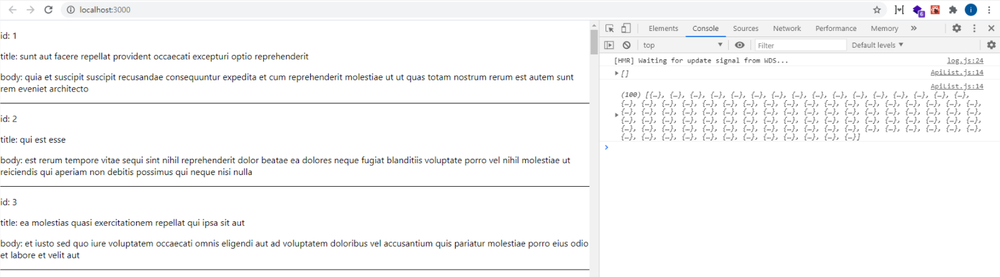

# api 연동하여, 컴포넌트에 적용하기

### 개요

React에서 api를 연동하여, 어떻게 컴포넌트에 적용시키는지에 대해 알아보겠다.

api를 연동할때, 주로 사용되는 방법은 fetch와 axios가 있다.
하지만 fetch로 api를 연결하는 경우는 거의 없고, 대부분 axios와 같은 라이브러리를 사용하여 api연동을 한다.

먼저 fetch와 axios에 대해 간단하게 먼저 짚고 넘어가겠다.

React로 개발을 할 때 fetch와, axios를 사용하여, GET, PUT, POST, DELETE 등의 메서드로 API를 호출 할 수 있다.

만약 이 메서드들에 대하여 생소하다면, REST API에 대해 먼저 알아볼 필요가 있다.

> REST API는 HTTP URI를 통하여 자원을 명시하고, HTTP 메서드 (POST, GET, PUT, DELETE)를 통해 해당 자원에 대한 CRUD Operation을 적용하는 것을 의미 한다.

### CRUD Operation

- Create : 생성 (POST)
- Read : 조회(GET)
- Update : 수정(PUT)
- Delete : 삭제(DELETE)

이제 fetch를 사용하여 api를 호출하는 간단한 예제를 보자.

### fetch

#### src/component/apiList

```js
import React from "react";

class ApiList extends React.Component {
  state = {
    items: [],
  };
  componentDidMount() {
    fetch("https://jsonplaceholder.typicode.com/posts")
      .then((res) => res.json())
      .then((result) => this.setState({ items: result }));
  }
  render() {
    console.log(this.state.items);
    return <div></div>;
  }
}

export default ApiList;
```

> 리액트 공식문서에서 API을 연동을 통한 데이터는 생명주기 메서드 중 componentDidMount 안에 추가 되어야 한다고 한다. 그 이유는 데이터를 받아 올 때 setState를 통하여 컴포넌트를 업데이트하기 위함이다.

위의 코드를 함수형 컴포넌트에서 Hooks으로 표현할 수 있다. 코드는 다음과 같다.

```js
import React, { useState, useEffect } from "react";

const ApiList = () => {
  const [items, setItems] = useState([]);

  useEffect(() => {
    fetch("https://jsonplaceholder.typicode.com/posts")
      .then((res) => res.json())
      .then((result) => setItems(result));
  }, []);

  console.log(items);

  return <div></div>;
};

export default ApiList;
```

jsonplaceholder는 가상의 데이터가 필요할 때 사용할 수 있는 무료 온라인 REST API 이다.

이 포스트에서는 위의 url을 통하여, API 연동을 할 것이다.

이제, 작성이 완료 되었으면, 실행 시킨 후, 브라우저 콘솔에서 확인해보자.

```js
[
    {
        "userId": 1,
        "id": 1,
        "title": "sunt aut facere repellat provident occaecati excepturi optio reprehenderit",
        "body": "quia et suscipit
suscipit recusandae consequuntur expedita et cum
reprehenderit molestiae ut ut quas totam
nostrum rerum est autem sunt rem eveniet architecto"
    },
    {
        "userId": 1,
        "id": 2,
        "title": "qui est esse",
        "body": "est rerum tempore vitae
sequi sint nihil reprehenderit dolor beatae ea dolores neque
fugiat blanditiis voluptate porro vel nihil molestiae ut reiciendis
qui aperiam non debitis possimus qui neque nisi nulla"
    },
    {
        "userId": 1,
        "id": 3,
        "title": "ea molestias quasi exercitationem repellat qui ipsa sit aut",
        "body": "et iusto sed quo iure
voluptatem occaecati omnis eligendi aut ad
voluptatem doloribus vel accusantium quis pariatur
molestiae porro eius odio et labore et velit aut"
    },
    {...}
]
```

이러한 데이터 들을 fetch를 사용하여 데이터를 가져온 것을 확인 할 수 있다.

이제 React에서 많은 사람들이 API 연동을 위해 사용하는 방법인 axios에 대해 알아보겠다.

### axios

axios를 사용하기 위해서는 우선 라이브러리를 설치 해야한다.
다음과 같이 설치 해보자.

```js
npm install axios
```

설치가 완료 되었다면, fetch의 코드와 동일한 방식으로, 간단한 예제를 만들어 보겠다.

#### src/components/ApiList

```js
import React, { useState, useEffect } from "react";
import axios from "axios"; //추가

const ApiList = () => {
  const [items, setItems] = useState([]);

  //변경
  useEffect(() => {
    axios
      .get("https://jsonplaceholder.typicode.com/posts")
      .then((res) => setItems(res.data));
  }, []);
  console.log(items);
  return <div></div>;
};

export default ApiList;
```

위와 같이 axios를 사용하기 위해서는 axios를 import 해야 한다.

또한, axios는 JSON데이터로 자동 변환이 가능 하기 때문에 .json()을 하지 않아도 된다.

코드 작성이 완료되었다면, 프로젝트 실행 후 브라우저의 콘솔을 확인해 보자. fetch와 동일한 내용을 확인할 수 있다.

그렇다면 fetch와 axios의 차이점이 무엇일까?

### fetch

- 자바스크립의 내장 라이브러리 이기때문에 import하지 않고 사용할 수 있다.
- 네트워크 에러가 발생했을 경우 기다려야 한다.
- 지원하지 않는 브라우저가 있다.
- return 값은 Promise 객체 형태이다.

### axios

- axios의 라이브러리를 따로 설치를 하고, import를 해야 사용 할 수 있다.
- request aborting(요청취소) 및 응답시간 초과 설정 등의 기능이 있다.
- JSON데이터 자동 변환이 가능하다.
- catch에 걸렸을때, then을 실행하지 않고 콘솔창에 해당 에러의 로그를 보여준다.
- return 값은 Promise 객체 형태이다.

이와같이 fetch 및 axios의 차이점에 대해 알아보았다. 이러한 차이점을 봤을때만 해도 왜 많은 사람들이 axios를 선호하는지 알 수 있다.

그러면 이제 fetch 및 axios를 사용하여 api 연동하는법을 알아보았으니, 이 데이터를 컴포넌트에 적용 시키는 법에 대해 알아보자.

### API 연동하여 컴포넌트에 적용

#### src/components/ApiList

```js
import React, { useState, useEffect } from "react";
import axios from "axios";

const ApiList = () => {
  const [items, setItems] = useState([]);

  useEffect(() => {
    axios
      .get("https://jsonplaceholder.typicode.com/posts")
      .then((res) => setItems(res.data));
  }, []);
  console.log(items);

  // CSS-in-JS
  const listStyles = {
    borderBottom: "1px solid",
  };
  return (
    <div>
      {items.map((item) => (
        <div key={item.id} style={listStyles}>
          <p>id: {item.id}</p>
          <p>title: {item.title}</p>
          <p>body: {item.body}</p>
        </div>
      ))}
    </div>
  );
};

export default ApiList;
```

useEffect 에서 axios를 사용하여 api 호출을 하였다.

api 호출 url는 가상데이터를 제공하는 무료 api 사이트인 jsonplaceholder를 이용하였고, GET 메서드를 사용하여, 데이터를 불러 왔다.

불러온 데이터를 **setItems**를 사용하여, state값에 저장하였다.

이 setItems는 클래스형 컴포넌트에서 제공하는 this.setState와 동일한 기능을 가진다.

그리고 가상의 데이터의 items라는 배열을, map 함수를 통하여, 컴포넌트에 적용 하였다.

위 코드를 작성 완료 하였다면, 브라우저에서 실행을 해보자.



위와 같이 브라우저에 나온다면 정상적으로, 작동 하는 모습을 확인 할 수 있다.

추가로 간단하게 API를 불러오는동안 Loading 중이라는 문구를 화면에 띄우는 방법을 알아보겠다.

```js
import React, { useState, useEffect } from "react";
import axios from "axios";

const ApiList = () => {
  const [items, setItems] = useState([]);
  const [loading, setLoading] = useState(false); //추가

  // 변경
  const getApi = async () => {
    try {
      setLoading(true);
      await axios
        .get("https://jsonplaceholder.typicode.com/posts")
        .then((res) => setItems(res.data));
    } catch (e) {
      console.log(e);
    } finally {
      setLoading(false);
    }
  };

  useEffect(() => {
    getApi();
  }, []);

  const listStyles = {
    borderBottom: "1px solid",
  };

  // 추가
  if (loading) return <div>데이터를 불러오는 중입니다....</div>;
  return (
    <div>
      {items.map((item) => (
        <div key={item.id} style={listStyles}>
          <p>id: {item.id}</p>
          <p>title: {item.title}</p>
          <p>body: {item.body}</p>
        </div>
      ))}
    </div>
  );
};

export default ApiList;
```

getApi 함수를 보면 async, await 문법을 사용하였다.

async, await 는 자바스크립트의 비동기 처리의 문법 이다.

#### 비동기 처리란?

비동기란? 요청을 보낸 후 응답과 상관 없이 다음 동작을 실행하는 방식이다.

그렇다면 이와 반대로 동기도 있다.

동기란 요청을 보낸 후 해당 요청의 응답을 받아야 다음 동작을 실행하는 방식이다.

그래서 getApi 함수는 비동기(async)라는 것을 알려주며, axios를 수행하여 데이터를 가져올 동안 기다린다(await) 라는 의미로 해석 하면 이해하기 쉽다.

위의 코드로 변경이 완료 되었으면, 브라우저로 확인해보자.

데이터가 금방 불러와져 "데이터를 불러오는 중입니다...." 이 텍스트가 화면에 보였다가 금방 사라진다.

만약 axios로 데이터를 불러오는 시간이 길어진다면, 로딩 텍스트가 더 오래 보일것이다.

### 마치며

리액트에서 API를 연동하는 방법인 fetch와 axios에 대한 차이 및 사용 방법에 대해 알아 보았다.

API 연동을 하기전 REST API에 대한 내용을 모른다면, 반드시 그 내용을 숙지한 후에 사용하는것이 바람직하다.

참고 : [https://ko.reactjs.org/docs/faq-ajax.html](https://ko.reactjs.org/docs/faq-ajax.html)
