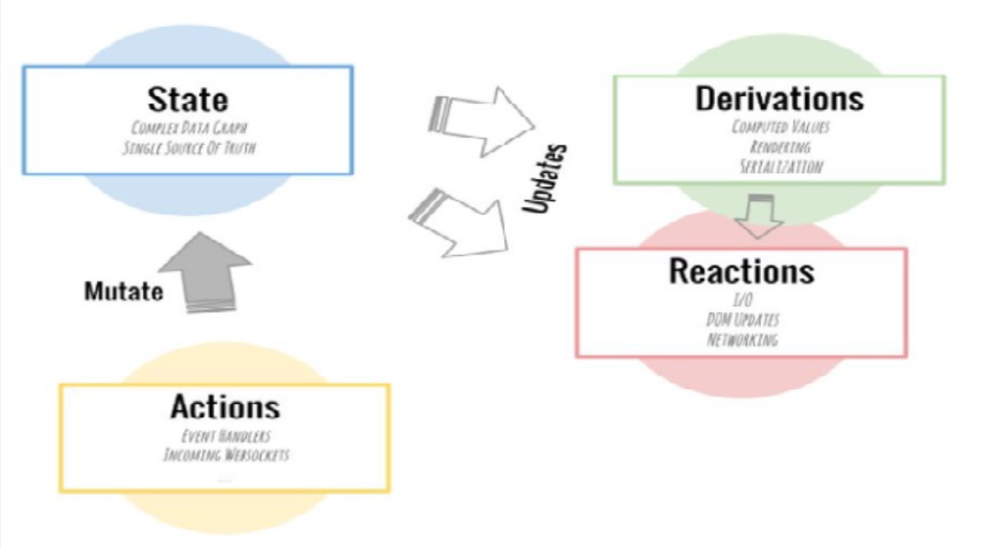

# Mobx에 대한 주요 개념에 대해 알아보기 (1)

### 개요

전역 상태 관리를 할 수 있는 Mobx의 대한 개념 및 소개에 대해 알아보겠다.

React에서 전역 상태 관리 라이브러리를 생각하면 가장 먼저 또오르는 것이 Redux 이다.

그다음에 Mobx라는 라이브러리가 사용 된다고 생각한다.

Mobx는 Redux와 비교하면 러닝커브가 낮은편으로, 초심자가 이해하기 더욱 쉽고 금방 적응 하실 수 있다.

또한, Mobx는 Redux와 같이 리액트에 종속되어 있는 라이브러리가 아니고, React 뿐만 아니라 Vue.js와 같은 웹 라이브러리에 적용 할 수 있다.

### Mobx란 무엇인가?

Mobx는 전역 상태 관리 라이브러리 이다. 모든 상태 변화가 일어나는 부분을 자동으로 추적해 주는 역할을 한다.

그렇다면 **상태관리**는 왜 필요할까?

프로젝트 규모가 작을때는, 부모와 자식간의 데이터를 주고 받기 쉬워, state의 추적이 쉽다.

하지만 규모가 커질수록 state를 파악하기가 어려워 진다.

그래서, Mobx 및 Redux와 같은 전역 상태 관리 라이브러리는 유지보수가 쉬워지도록 State 로직을 분리하여, 모듈화 할 수있으며, 상태 관리의 단계를 간결하게 해주는 역할을 한다.

### Mobx의 핵심 기능

위의 이미지는 Mobx의 Data Flow 이다.

mobx의 주요기능은 다음과 같다.

**1. Observable State**

Observable State는 관찰 받고 있는 상태를 의미 한다.

Mobx를 사용하고 있는 앱의 상태는 Observable 하다. 이 말은 즉, 이 상태는 관 할 수 있는 상태라는 것이다.

State는 변할 수 있으며, 만약 특정 부분이 바뀌면, Mobx에서는 정확히 어떤 부분이 바뀌었는지 파악 할 수 있다.

**2. Actions**

Action은 State의 변화를 일으키는 것을 의미 한다.
즉, Observable State에 변화를 일으키는 코드를 호출 하는 기능을 말한다.

**3. Computed Value**

Computed Value는 Action 발생으로 인해 어떠한 연산에 필요로 하는 state에 변화가 생겼을때, 그 state 변화에 따라서 새로운 연산 작업을 수행하게 된다.

이번 포스트에서는 상세히 다루지 않을 것이며, 추 후에 이에 대해 알아보자. (아마도 다음 포스트에 작성 할 것임)

**4. Reactions**

Reactions는 Computed Value와 비슷하다.

Compouted Value의 경우 특정값을 연산 해야 될 때 처리되지만, Reactions는 값이 바뀜에 따라 해야할 일을 정하는 것을 의미한다.

예를 들어, Observable State의 값이 바뀔때, 다른 값을 초기화 하거나, console.log("reactions") 처럼 출력을 할 수 있다.
(console.log는 실제로 사용되지않고, 이러한 흐름을 이해하자.)

위와 같이 4가지 기능은 Mobx에서 사용되는 핵심 개념이다.

간략하게 흐름을 정리해보면 다음과 같다

1. Observable State의 초깃값을 정의 한다.
2. Event Handler가 발생 하였을때, Action을 발생 시킨다.
3. Action을 통하여 상태 값을 업데이트 시킨다.
4. 이전 상태와 비교를 하여 같은 경우 멈추고, 다를 경우 리랜더링과 같은 Side Effect를 발생시킨다.
5. 또한, state에 변화가 생겼을때, 그 state 변화에 따라서 새로운 연산 작업을 수행하게 한다.

### Redux와 Mobx의 차이점

**Redux**

- 리액트에 종속되어 있는 라이브러리가 아니며, 리액트 스럽다 - state의 불변성 유지가 중요
- Flux 패턴을 따른다 - **Flux**란 Dispactcher, Stores, Views라는 핵심적인 세부분으로 구성 되어있다.

  - 단일 스토어로 구성, 함수형 프로그래밍, 미들웨어 등 주요개념
  - dispatch 관리를 위해 redux-sage 및 redux-thunk 와 같은 미들웨어가 필수

- 함수형 프로그래밍에 익숙하지 않으면, 까다로움
- action, reducer, dispatch 등의 기능이 존재

**Mobx**

- 객체지향적임
- 단일 스토어를 강제하지 않아 여러개의 스토어로 구성 가능
- state의 불변성을 신경쓰지 않아도 됨
- 데코레이터 사용
- Redux보다 러닝커브가 낮음

### 마치며

전역 상태 관리를 왜 하는지(필요성)에 대한 개념적인 내용 그리고 전역 상태 관리를 하기위한 Mobx라는 라이브러리의 핵심 기능에 대하여 알아보았다.

이 Mobx라이브러리를 리액트에 어떻게 활용하는지에 대해 다음 포스트에서 알아보자.

참고 : [https://mobx.js.org/the-gist-of-mobx.html](https://mobx.js.org/the-gist-of-mobx.html)
