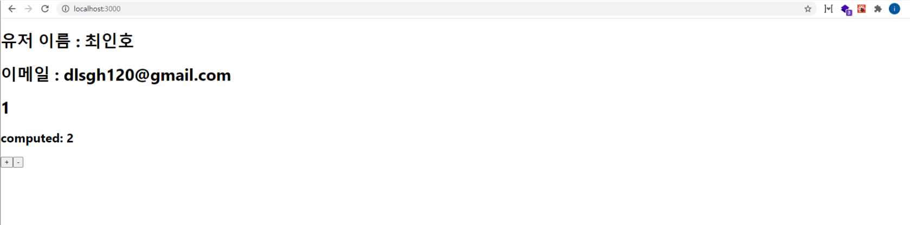

# Mobx를 store로 분리하여 사용 하기(3)

### 개요

Mobx로 상태를 관리할때, Store로 분리하여 사용하는 방법에 대하여 알아 보자.

기존에, 한 파일 안에 그에 해당하는 Mobx를 작성하는 것이아니라, Store로 분리하면, 더욱더 효율적으로 상태를 관리할 수 있다.

또한, Mobx는 Redux와 달리 스토어를 여러개 만들 수 있으며, 기능별, 로직별로 원하는 대로 store를 분리하여 깔끔하게 비지니스 로직을 작성할 수 있다.

### Store 분리하기

먼저 src 폴더안에 stores라는 폴더를 만든 후, counterStore.js를 만들고 다음과 같이 코드를 작성해보자.

코드는 지난 포스트에서의 Counter 기능에 대한 내용을 이어서 작성하겠다.

#### src/stores/counterStore.js

```js
import { makeObservable, observable, action } from "mobx";

export default class countStore {
  constructor() {
    makeObservable(this);
  }

  @observable
  counter = 0;

  @action
  increase = () => {
    this.counter++;
  };

  @action
  decrease = () => {
    this.counter--;
  };
}
```

counterStore는 기존 Counter 컴포넌트에서 카운트를 수행하는 기능과 동일하다.

그다음, src/index.js 파일을 다음과 같이 변경해보자.

```js
import React from "react";
import ReactDOM from "react-dom";
import "./index.css";
import App from "./App";
import reportWebVitals from "./reportWebVitals";

import { Provider } from "mobx-react"; //추가
import CounterStore from "./stores/counterStore"; //추가

const counterStore = new CounterStore(); //추가

ReactDOM.render(
  <React.StrictMode>
    <Provider counterStore={counterStore}>
      {" "}
      //추가
      <App />
    </Provider>
  </React.StrictMode>,
  document.getElementById("root")
);

reportWebVitals();
```

먼저 mobx-react 라이브러리에서 Proveider를 import 한다.

그리고, 이전의 Mobx의 store를 담당하는 counterStore를 import 하고, counterStore라는 인스턴스를 생성 해준다.

마지막으로 App 컴포넌트를 Provider로 감싸주며, counterStore를 추가 한다.

이러하여 App 컴포넌트 내에서, counterStore 에서 정의한 Mobx 기능들을 사용 할 수 있다.

이제 기존 Counter 컴포넌트를 다음과 같이 작성하자.

```js
import React from "react";
import { observer, inject } from "mobx-react"; //추가

@inject("counterStore") //추가
@observer
class Counter extends React.Component {
  render() {
    const counterStore = this.props.counterStore; //추가
    return (
      <div>
        <h1>{counterStore.counter}</h1>
        <button onClick={counterStore.increase}>+</button>
        <button onClick={counterStore.decrease}>-</button>
      </div>
    );
  }
}

export default Counter;
```

기존에 있던 observable 및 action 기능은 store에서 관리된다.
하지만 이 컴포넌트에서, 상태의 변화 등을 감지하기 위해 observer는 그대로 두어야 한다.

또한, 이 컴포넌트에서 counterStore 기능을 사용하기 위해 inject 해 주어야 한다.

위와 같이, counterStore, index.js, Counter 컴포넌트의 작성이 완료 되었다면, 프로젝트를 실행하여 정상적으로 작동되는지 확인해 보자.

작동 확인 후, 추가로 computed에 대하여 어떻게 사용하는지에 알아 보자.

#### computed

전전 내용(Mobx에 대한 주요 개념에 대해 알아보기 (1)) 에서 다루었듯이, compouted란 Action 발생으로 인해 어떠한 연산에 필요로 하는 state 변화가 생겼을 때, 그 state 변화에 따라서 새로운 연산 작업을 수행 하게 되는 Mobx의 핵심 기능이다.

그럼 다음 예제를 통하여 간단하게 알아보자.

counterStore를 다음과 같이 변경해보자.

#### src/stores/counterStore

```js
import { makeObservable, observable, action, computed } from "mobx"; // computed 추가

export default class countStore {
  constructor() {
    makeObservable(this);
  }

  @observable
  counter = 0;

  // 추가
  @computed
  get double() {
    return this.counter * 2;
  }

  @action
  increase = () => {
    this.counter++;
  };

  @action
  decrease = () => {
    this.counter--;
  };
}
```

위와 같이 increase 및 decrease의 Action이 발생되어 counter 값이 변경되었을때, double은 computed를 수행하여 기존 counter 값에 \*2를 수행한 후, return 된다.

그러면 Counter 컴포넌트에 computed 값인 double을 추가하여, 브라우저에서 확인해보자.

#### src/components/Counter

```js
import React from "react";
import { observer, inject } from "mobx-react";

@inject("counterStore")
@observer
class Counter extends React.Component {
  render() {
    const counterStore = this.props.counterStore;
    return (
      <div>
        <h1>{counterStore.counter}</h1>
        // 추가
        <h2> computed: {counterStore.double}</h2>
        <button onClick={counterStore.increase}>+</button>
        <button onClick={counterStore.decrease}>-</button>
      </div>
    );
  }
}

export default Counter;
```

만약에, store가 여러개일 경우에는 어떻게 활용을 해야 할까?
간단한 예제를 통해서, userStore를 추가하여, 같이 사용해 보자.

stores 폴더에 userStore.js파일을 추가한다.

#### src/stores/userStore.js

```js
import { makeObservable, observable } from "mobx";

export default class userStore {
  constructor() {
    makeObservable(this);
  }

  @observable
  userName = "최인호";

  @observable
  userEmail = "dlsgh120@gmail.com";
}
```

이 userStore에서는 store가 여러개일 경우 어떻게 활용하는 지를 중점으로 다루기 때문에 action 및 computed에 대한 내용은 생략한다.

작성이 완료 되었다면, store에 index.js를 추가 해야 한다.

#### src/stores/index.js

```js
import CounterStore from "./counterStore"; //counterStore 가져오기
import UserStore from "./userStore"; //userStore 가져오기

class RootStore {
  constructor() {
    // 생성한 store를 binding 시켜준다
    this.counterStore = new CounterStore(this);
    this.userStore = new UserStore(this);
  }
}

export default RootStore;
```

현재 상황은 counter와, user의 관계가 전혀 없기에 서로의 접근이 불필요한 상황이다.

하지만, 여러개의 스토어가 어떻게 관계가 형성되어 접근을 하는지 알아보기 위해 RootStore를 만들어 준다.

이렇게 함으로써 각 스토어들이, 현재 루트 스토어가 무엇인지 알 수 있게 된다.

RootStore가 생성되었다면, 이제 src/index.js 파일을 조금 수정해야한다.

기존 index.js 파일에서 countStore에 대한 생성자를 이제 RootStore로 바꾼다.

#### src/index.js

```js
// ...import 내용 기존과 동일

import { Provider } from "mobx-react";
import RootStore from "./stores"; //변경

const stores = new RootStore(); //변경

ReactDOM.render(
  <React.StrictMode>
    <Provider {...stores}>
      {" "}
      // 변경
      <App />
    </Provider>
  </React.StrictMode>,
  document.getElementById("root")
);

reportWebVitals();
```

위와 같이 적용이 완료되었다면, 마지막으로 counterStore와 userStore를 Counter 컴포넌트에서 적용해보겠다.

#### src/components/Counter

```js
import React from "react";
import { observer, inject } from "mobx-react";

@inject("counterStore", "userStore")
@observer
class Counter extends React.Component {
  render() {
    const { counterStore, userStore } = this.props;
    return (
      <div>
        <h1>유저 이름 : {userStore.userName}</h1>
        <h1>이메일 : {userStore.userEmail}</h1>

        <h1>{counterStore.counter}</h1>
        <h2> computed: {counterStore.double}</h2>
        <button onClick={counterStore.increase}>+</button>
        <button onClick={counterStore.decrease}>-</button>
      </div>
    );
  }
}

export default Counter;
```

브라우저로 확인해보자.



이러한 방식으로 Mobx 라이브러리는 store를 여러개를 만들어, 리액트에서 상태를 관리 한다.

### 마치며

리액트로 개발하면서, 컴포넌트가 많아지고 규모가 커질 수록 더욱 더, 전역 상태 관리의 필요성 및 중요성을 느낄 것이다.

그중 Mobx에 대한 개념, 사용법 그리고 데코레이터 및 스토어 관리 등에 대하여 알아 보았다.

참고 : [Mobx 공식 홈페이지](https://mobx.js.org/README.html)
