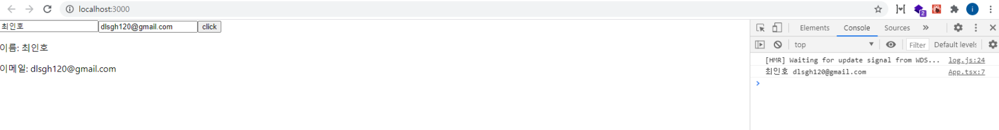

# 리액트 Typescript로 적용 및 작성하기

### 개요

지난 포스트 까지는 Javascript로 리액트를 작성하였다.

이번에는 Javascript 말고, Typescript(타입스크립트) 언어로 리액트를 작성하는 방법에 대해 알아 보겠다.

### Typescript 란?

Typescript는 자바스크립트의 슈퍼셋인 오픈소스 프로그래밍 언어이며.
마이크로소프트에서 개발, 유지하고 있으며 엄격한 문법을 지원한다.

타입스크립트의 주요 기능 및 장점은 정적 타입 언어 (Static type language) 이기 때문에, 컴파일시 시간이 조금 더 걸리더라도 안정성을 보장 한다는 점이다.

자바스크립트는 동적 타입 언어(dynamic type language) 이기 때문에, 자유 분방한 타입을 가진다.

그렇기에 리액트 뿐만 아니라, Javascript언어로 작성된 코드의 규모가 커질 수록, 타입의 문제로 인하여 얘기치 못한 에러가 발생 할 수 있다.

자바스크립트의 예제를 간단히 살펴보자.

```js
let a = "hello";
a = 1;
console.log(a); // output: 1
```

이런식으로 a의 변수는 string type으로 정의 되었는데 number type으로 바뀐 모습을 볼 수 있다.

반대로 타입스크립트는 다음과 같다.

```js
let a: string = "hello";
a = 1;
console.log(a); // ouput: type error
```

이와 같이 타입스크립트를 적용하면, a를 1로 변경 할때, 타입이 맞지 않아 에러가 발생하는 것을 확인할 수 있다.

이러한 문제로 프로젝트의 규모가 커질수록 코드가 복잡해지며, 디버그와 테스트 공수가 증가하는 문제가 있어 많은 사람들이 Typescript로 개발을 많이 한다.

### Typescript의 장점?

- 정적 타입 - 컴파일 단계에서 오류를 포착할 수 있는 장점이 있다.
- 도구의 지원 - IDE와 같은 도구에 타입 정보를 제공함으로써 높은 수준의 코드, 타입체크, 리팩토링 등을 지원 받을 수 있으며, 이러한 도구의 지원은 대규모 프로젝트를 위한 필수 요소이다.
- 강력한 객체 지향 프로그램 지원 - Java, C# 등의 클래스 기반 객체지향 언어에 익숙한 개발자가 자바스크립트 프로젝트를 수행하는데 진입장벽을 낮추는 효과가 있다.

### React에서 Typescript로 작성

그렇다면 React에서 Typescript로 작성하기 위한 방법에 대해 알아보자

#### 타입스크립트를 사용하는 새로운 리액트 프로젝트를 만드는 방법

```js
npx create-react-app react-ts-tutorial --template typescript
```

위와 같이 터미널에 입력하면, typescript를 사용하는 React 프로젝트를 쉽게 만들 수 있다.

#### 이미 javascript 로 만들어진 프로젝트에 적용하기

```js
npm install --save @types/react @types/react-dom
```

위와같이 명령어를 입력하여, 타입 정의 파일을 설치 한다.

그리고 타입스크립트 코드를 작성하기 위해 typescript 패키지도 설치한다.

```js
npm install --save-dev typescript
```

설치가 완료 되었다면, tsconfig.json 파일을 만들어 주어야 한다.

다음과 같이 실행하면, tsconfig.json 파일이 자동으로 생성 된다.

```js
npx typescript --init
```

tsconfig.json 파일이 자동으로 생성 되었을 것이다. 안에 내용을 확인 한번 해보자.

```js
{
  "compilerOptions": {
    ...
    ...
    // "lib": [],                                   /* Specify library files to be included in the compilation. */
    // "allowJs": true,                             /* Allow javascript files to be compiled. */
    // "checkJs": true,                             /* Report errors in .js files. */
    "jsx": "react",                           /* Specify JSX code generation: "preserve", "react-native", "react"
, "react-jsx" or "react-jsxdev". */
    // "declaration": true,                         /*
    ...
    ...
}
```

리액트의 jsx 코드를 사용하기 위해서 compiorOptions의 jsx 속성에 "react"값을 추가 해주어야 한다.

이제 js또는 jsx로 된 확장자를 .tsx로 작성하여 리액트에 타입스크립트를 적용하여 개발 할 수 있다.

타입스크립트를 사용하여 리액트 개발이 어떻게 진행 되는지 알아보기전, 타입을 어떻게 지정하는지에 대해 간단히 알아보자.

### 명시적 타입지정

```js
const name: string = "choi";
```

이렇게 **변수명 : 타입** 으로 표현 되는 방식이다.

### 타입 별칭 지정

```js
type Name = string;

const name: Name = "choi";
```

type을 선언하여 Name 이라는 string 타입을 지정해준다.

객체 타입은 다음과 같이 지정 할 수 있다.

```js
type User = {
  name: string,
  age: number,
};

const user: User = {
  name: "choi",
  age: 27,
};
```

### interface

```js
type Age = number;

interface User {
  name: string;
  age: Age;
}
const user = {
  name: "choi",
  age: 27,
};
```

이렇게 interface로 타입을 지정하는 방식도 있다.

type과 interface 방식은 비슷해 보이는데 어떠한 차이가 있을까?

### type 과 interface 의 차이

타입과 인터페이스는 유사하지만, 차이점이 있다.

- 타입은 새로운 이름을 만들지 않는다. 쉽게 말하자면, 에러 메세지 같은 곳에서 타입 별칭으로 출력되지 않고, 실제 타입을 출력 한다. 하지만 인터페이스는 새로운 이름을 만든다.
- 인터페이스는 상속(extends) 되거나, 구현(implements) 될 수 있다.
- 인터페이스는 여러 병합된 선언을 가질 수 있다. 예를들면, 같은 이름의 인터페이스를 여러번 선언할 수 있다.

이러한 차이점들이 있어, 공식 문서에서는 최대한 타입 대신 인터페이스를 사용을 권장 하고 있다.

인터페이스로 표현할 수 없는 형태이거나, 유니온 혹은 튜플을 사용해야 하는 경우라면 타입을 사용 해야 한다고 한다.

이제 간단한 예제를 통해서, 리액트에서 타입스크립트로 어떻게 작성 되는지 알아보겠다.

### typescript 적용하기

우선 components 폴더에 Greetings.tsx 파일을 만들고 다음과 같이 코드를 작성해 보자.

#### src/components/Greetings.tsx

```js
import React from "react";

//추가
interface GreetingsProps {
  name: string;
}

const Greetings = (props: GreetingsProps) => {
  const { name } = props;

  return (
    <div>hello {name}</div>
    );
};

export default Greetings;
```

이제 App 컴포넌트도 다음과 같이 작성해 보자.

#### src/App.tsx

```js
import React from "react";
import Greetings from "./components/Greetings"; //추가

const App: React.FC = () => {
  return (
    <Greetings name="choi" />
    );
};

export default App;
```

Greetings 컴포넌트에 name을 props로 전달 받았으며, interface로 타입을 지정하였다.

Greetings 컴포넌트를 arrow function 말고 다음과 같이 표현할수도 있다.

```js
interface GreetingsProps {
  name: string;
}

function Greetings({ name }: GreetingsProps) {
  return (
    <div>hello {name}</div>
    );
}

export default Greetings;
```

만약 interface의 name을 string에서, number로 바꾸면 타입이 맞지않아 에러가 발생 할 것이다.

이렇게 타입을 명확하게 지정하여, 에러를 잡을 수 있다.

이제 State 및 이벤트 핸들러에 타입스크립트로 어떻게 작성되는지 간단하게 알아보자.

```js
import React, { useState } from "react"; // useState 추가

// 타입 별칭 지정
type User = {
  name: string,
  email: string,
};

const Greetings = () => {
  // 타입 선언
  const [user, setUser] = useState<User>({ name: "", email: "" });

  // e 타입은 다음과 같이 지정해준다.
  const changeHandler = (e: React.ChangeEvent<HTMLInputElement>) => {
    setUser({ ...user, [e.target.name]: e.target.value });
  };

  return (
    <div>
      <input
        type="text"
        value={user.name}
        name="name"
        onChange={changeHandler}
      />
      <input
        type="text"
        value={user.email}
        name="email"
        onChange={changeHandler}
      />

      <p>이름: {user.name}</p>
      <p>이메일: {user.email}</p>
    </div>
  );
}

export default Greetings;
```

위의 내용은 기존 javascript로 작성된, 사용자 이름 및 이메일에 대해 change 이벤트 핸들러가 발생 했을때, state값을 변경 시켜주는 기능과 동일 하다.

다만 추가된 내용을 확인해보자면, state에 타입지정 및, change 이벤트 핸들러가 발생 했을때, e의 타입 등이 추가 되었다.

만약, 이 컴포넌트에서 특정 함수를 props로 받아와야 한다면 어떻게 타입을 지정 해야 할까?

다음과 같이 타입을 지정 할 수 있다.

### src/App.tsx

```js
import React from "react";
import Greetings from "./components/Greetings";

// interface로 정의 가능
type User = {
  name: string,
  email: string,
};

const App = () => {
  // 추가
  const clickUserData = (user: User) => {
    console.log(user);
  };
  return (
    <Greetings
      clickUserData={clickUserData} //추가
    />
  );
};

export default App;
```

Greetings 컴포넌트를 다음과 같이 추가하자.

#### src/components/Greetings.tsx

```js
import React, { useState } from "react";

type User = {
  name: string,
  email: string,
};

//추가
interface GreetingsProps {
  clickUserData: (name: string, email: string) => void;
}

//추가
const Greetings = ({ clickUserData }: GreetingsProps) => {
  const [user, setUser] = useState<User>({name: "", email: ""});

  const changeHandler = (e: React.ChangeEvent<HTMLInputElement>) => {
    setUser({ ...user, [e.target.name]: e.target.value });
  };

  //추가
  const clickHandler = () => {
    clickUserData(user.name, user.email);
  };
  return (
    <div>
      <input
        type="text"
        value={user.name}
        name="name"
        onChange={changeHandler}
      />
      <input
        type="text"
        value={user.email}
        name="email"
        onChange={changeHandler}
      />
      // 추가
      <button onClick={clickHandler}>click</button>
      <p>이름: {user.name}</p>
      <p>이메일: {user.email}</p>
    </div>
  );
}

export default Greetings;
```

위의 코드와 같이 clickUserData 함수를 props로 받아와, 타입 지정을 하였다.

그러면 이제 한번, 프로젝트를 실행하여 잘 작동하시는지 확인해보자.



### 마치며

프로젝트의 규모가 커질수록 코드가 복잡해지기에, 디버그와 테스트 공수가 증가하는 문제가 있어 많은 사람들이 Typescript로 개발을 많이 하고있다.

그렇기에 타입스크립트가 무엇인지에 대한 개념 및, 리액트에서 타입스크립트로 만들때의 장점, 그리고 타입스크립트로 리액트를 작성하는 방법 등에 대해 알아보았다.

참고 : [https://create-react-app.dev/docs/adding-typescript/](https://create-react-app.dev/docs/adding-typescript/)
