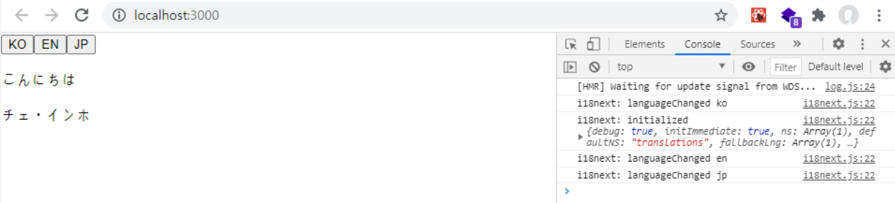

# 다국어 처리 react-18next 사용해보기

### 개요

리액트에서 react-i18next를 사용하여, 다국어 처리하는 방법에 대해 알아보겠다.

웹 서비스를 할때, 다국어를 지원 해야 하는 경우가 있다.

이는 접속하는 국가 또는 지역에 따라 다른 언어가 자동으로 지원되거나, 웹사이트 내에서 언어를 변경하는 기능을 제공 하기도 한다.

### i18n 이란?

국제화(internationalization : i18n) 이란 줄여서 i18n이라고 표기 한다. 

이 의미는, 이 용어의 영어 표기에서 첫 글자인 **i**자와 마지막 글자인 **n**의 사이에 18글자가 들어가 있다는 의미다.

국제화는 제품이나 서비스를 특정 지역의 언어나 문화에 맞추는, 즉 현지화 라고 불리는 과정을 쉽게 할 수 있도록 계획하거나 이행하는 과정을 말한다.

i18next는 위에 설명한 i18n을 자바스크립트 상에서 사용할 수 있도록 제작된 라이브러리 이다.

이제 리액트에서 간단하게 다국어 처리를 하는 방법에 대해 알아보자.

먼저 다음과 같이 다국어 처리를 위해 필요한 라이브러리를 설치 해야한다.

```js
// javascript for react
npm install react-i18next i18next

// typescript for react
npm install react-i18next @types/react-i18next i18next @types/i18next
```

설치가 완료 되었다면, src폴더 내부에 lang이라는 폴더를 만들고,
translation.en.json, translation.ko.json, i18n.ts 라는 3개의 파일을 만든 후, 다음과 같이 코드를 작성하자.

#### src/lang/translation.en.json

```js
{
    "hello": "Hello",
    "name": "choi inho"
}
```

#### src/lang/translation.ko.json

```js
{
    "hello": "안녕하세요",
    "name": "최인호"
}
```

translation.XX.json 파일은 다국어 처리를 하기위해, 각 나라별 언어를 설정한 파일 이다.

그리고, i18n 파일을 다음과 같이 작성해보자.

#### src/lang/i18n.ts

```js
import i18n from "i18next";
import { initReactI18next } from "react-i18next";
 
import TranslationEn from "./translation.en.json";
import TranslationKo from "./translation.ko.json";
 
const resource = {
    en: {
        translations: TranslationEn
    },
    ko: {
        translations: TranslationKo
    }
}
 
i18n
    .use(initReactI18next)
    .init({
        resources:resource,
        // 초기 설정 언어
        lng: "ko",
        fallbackLng: "ko",
        debug: true,
        defaultNS: "translations",
        ns: "translations",
        keySeparator: false,
        interpolation: {
            escapeValue: false
        }
    })
 
export default i18n;
```

위 코드를 보면, 각 json 파일들을 i18n의 resource로 관리 된다.

또한, 전환하고자 하는 언어는 동일한 key값을 가져야 한다.

ex) 이 예제는 json파일을 살펴보면, hello, name의 key값으로 동일하게 가지고있다.

그리고 i18n 초기화 시, 언어 리소스와 최초 언어 설정값을 추가 하면 된다.

이제 Translation 컴포넌트를 생성 후, 다음과 같이 적용해보자.

#### src/components/Translation.tsx

```js
import React from "react";
import {useTranslation} from "react-i18next";
import i18next from "../lang/i18n";

const Translation: React.FC = () =>{
    const {t} = useTranslation();

    const clickHandler = (lang:string) =>{
        i18next.changeLanguage(lang);
    }
    return(
        <div>
            <button onClick={()=>clickHandler("ko")}>KO</button>
            <button onClick={()=>clickHandler("en")}>EN</button>
            <p>{t("hello")}</p>
            <p>{t("name")}</p>
        </div>
    );
}

export default Translation;
```

위의 코드가 적용 완료 되었다면, 프로젝트를 실행 후, 확인해 보자.

i18n 파일에서 한국어로 초기화를 시켰기 때문에, 한국어가 나타 날 것이다.
그리고, Ko 버튼 및 En 버튼을 만들어 주었다.

버튼 click 이벤트 핸들러가 발생하였을때, 파라미터 값으로 **"ko"**, **"en"** 값을 전달 하였다.

그 이유는 src/lang/i18n 파일에서 다음 리소스를 확인해 보자.

```js
const resource = {
    en: {
        translations: TranslationEn
    },
    ko: {
        translations: TranslationKo
    }
}
```

위와 같이 리소스에 en 및 ko 값으로 설정해 주었기 때문이다.

그리고, 전달된 파라미터 값인 "ko" 및 "en" 으로 언어 변경을 수행하였다.

마지막으로, 한국어, 영어 뿐만아니라, 임의로 일본어를 추가하여 3가지의 언어를 처리해보자.

먼저 src/lang 폴더 내부에 translation.jp.json 파일을 추가해야한다.

#### src/lang/translation.jp.json

```js
{
    "hello": "こんにちは",
    "name": "チェ・インホ"
}
```

일본어는 구글 번역기를 통해 값을 입력하였다.
또한, 파일명의 jp란 일본의 국가코드로 위와같이 파일을 만들어 주었다.

작성이 완료되었다면, i18n.ts 파일에서, 리소스에 일본어를 추가해야한다.

#### src/lang/i18n.ts

```js
import i18n from "i18next";
import { initReactI18next } from "react-i18next";
 
import TranslationEn from "./translation.en.json";
import TranslationKo from "./translation.ko.json";
import TranslationJp from "./translation.jp.json"; // 추가
 
const resource = {
    en: {
        translations: TranslationEn
    },
    ko: {
        translations: TranslationKo
    },
    // 추가
    jp: {
        translations: TranslationJp
    }
}
 
i18n
    .use(initReactI18next)
    .init({
        resources:resource,
        // 초기 설정 언어
        lng: "ko",
        fallbackLng: "ko",
        debug: true,
        defaultNS: "translations",
        ns: "translations",
        keySeparator: false,
        interpolation: {
            escapeValue: false
        }
    })
 
export default i18n;
```

이제 Translation 컴포넌트에 JP 버튼을 만들자.

```js
import React from "react";
import {useTranslation} from "react-i18next";
import i18next from "../lang/i18n";

const Translation: React.FC = () =>{
    const {t} = useTranslation();

    const clickHandler = (lang:string) =>{
        i18next.changeLanguage(lang);
    }
    return(
        <div>
            <button onClick={()=>clickHandler("ko")}>KO</button>
            <button onClick={()=>clickHandler("en")}>EN</button>
            // 추가
            <button onClick={()=>clickHandler("jp")}>JP</button>
            <p>{t("hello")}</p>
            <p>{t("name")}</p>
        </div>
    );
}

export default Translation;
```

이제 프로젝트를 실행 한 후, 각 버튼을 눌러보자.



다국어 처리가 잘 작동 할 것이다.

### 마치며

이번 포스트에서는, i18n이 무엇인지, 그리고 이 다국어를 리액트에서 어떻게 적용 하는지에 대해 간단하게 알아보았다.
