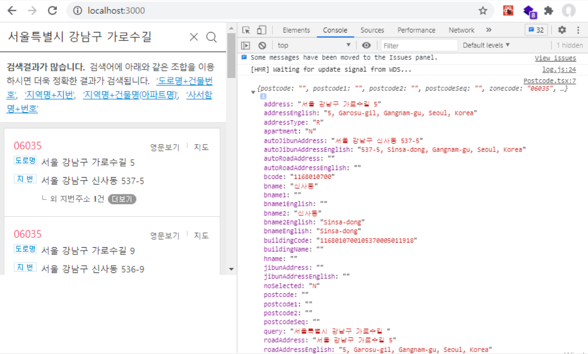
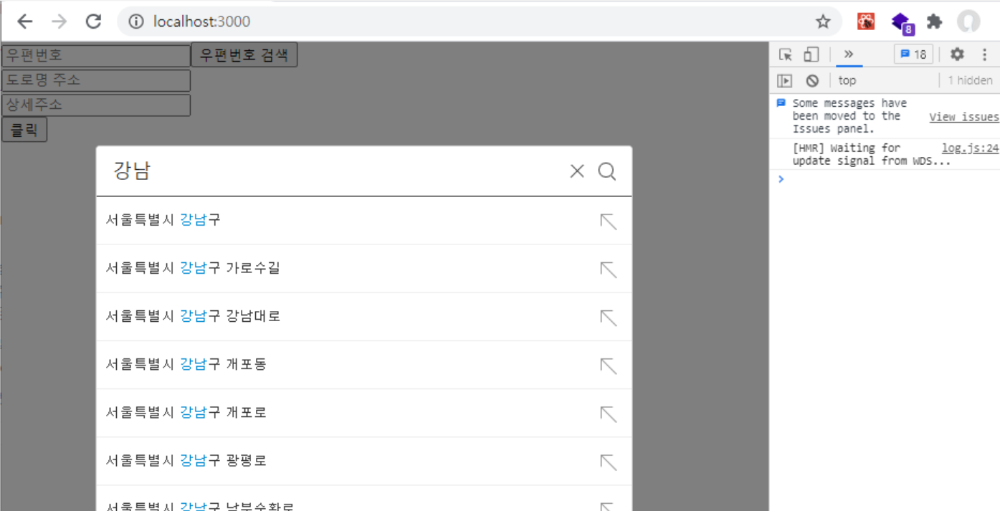

# react-daum-postcode를 사용하여, 우편번호 검색 해보기

### 개요

리액트에서 우편번호 검색에 사용되는 react-daum-post에 대해 알아보겠다.

이 기능은 주로, 회원가입 및, 이커머스 에서 배송지 입력 등 주소를 입력할때 많이 활용되는 라이브러리 이다.

### react-daum-postcode 설치

Daum Postcode API를 사용하기 위해, 다음과 같이 라이브러리를 설치 해야한다.

```js
npm install react-daum-postcode
```

설치가 완료 되었다면, Postcode 컴포넌트에 적용을 해보자.

#### src/components/Postcode.tsx

```js
import React from "react";
import DaumPostcode from "react-daum-postcode"; //추가

const Postcode: React.FC = () =>{

    //추가
    const completeHandler = (data:any) =>{
        console.log(data);
    }
    return(
        <div>
            //추가
            <DaumPostcode 
                onComplete={completeHandler}
            />
        </div>
    );
}

export default Postcode;
```

실행 하기 전, DaumPostcode의 props를 살펴보자.

onComplete는 DaumPostcode API를 사용할 때 반드시 사용되어야 할 필수 기능으로, 우편번호 검색이 끝났을 때, 사용자가 선택한 정보를 받아올 콜백 함수다.

만약 onComplete를 사용하지 않는다면, 에러가 발생할 것이다.

그러면 코드 적용이 완료되었다면, 프로젝트 실행을 해보자.

그리고, 주소를 입력한 후, 상세 주소를 클릭해 보자. 그러면 다음과 같이, console로 확인할 수 있다.



위와 같이 onComplete 이벤트가 발생하였을때, 위와 같이 데이터가 출력 된다.

그렇다면, 이 값이 선택 완료 되었을때, zipCode 및 roadAddress를 state로 관리하여, 화면에 출력되도록 적용해보자.

#### src/components/Postcode.tsx

```js
import React,{useState} from "react";
import DaumPostcode from "react-daum-postcode";

const Postcode: React.FC = () =>{
    // state 추가
    const [zipCode, setZipcode] = useState<string>("");
    const [roadAddress, setRoadAddress] = useState<string>("");
    const completeHandler = (data:any) =>{
        console.log(data);
        setZipcode(data.zonecode); // 추가
        setRoadAddress(data.roadAddress); // 추가
    }
    return(
        <div>
            <p>
                우편번호 : {zipCode} // 추가
            </p>
            <p>
                주소 : {roadAddress} // 추가
            </p>
            <DaumPostcode 
                onComplete={completeHandler}
            />
        </div>
    );
}

export default Postcode;
```

다음과 같이 작성이 완료 되었다면, 프로젝트 실행하여 한번 해보자.

daum-postcode에, 주소를 입력하여 클릭되었을때 state값이 변하여, 선택된 주소가 화면에 보일 것이다.

우편번호 검색 API 기능 사용법이 아주 간단하다.

하지만 이렇게 간단한 기능을 조금더 실제 서비스에서 사용 하듯이, 조금 꾸며보고 싶다.

보통은 우편번호 검색을 클릭했을때, 우편번호 창을 띄우거나, Modal 형식으로 처리 되면 더욱 더 깔끔한 모습으로 만들 수 있다.

그래서 우편번호 검색을 클릭했을때, Modal로 우편번호 검색을 띄우도록 구현 해보자.

Modal을 구현하기 전, react-modal 라이브러리를 사용하면 아주 쉽게 구현 할 수 있다.

### Modal 적용하기

```js
// javascript for react
npm install react-modal

// typescript for react
npm install react-modal @types/react-modal
```

설치가 완료 되었다면 다음과 같이 코드를 작성하자.

#### src/components/Postcode.tsx

```js
import React,{useState} from "react";
import DaumPostcode from "react-daum-postcode";
import Modal from "react-modal"; // 추가

const Postcode: React.FC = () =>{
    const [zipCode, setZipcode] = useState<string>("");
    const [roadAddress, setRoadAddress] = useState<string>("");
    const [detailAddress, setDetailAddress] = useState<string>("");    // 추가
    const [isOpen, setIsOpen] = useState<boolean>(false); //추가

    const completeHandler = (data:any) =>{
        setZipcode(data.zonecode);
        setRoadAddress(data.roadAddress);
        setIsOpen(false); //추가
    }

    // Modal 스타일
    const customStyles = {
		overlay: {
			backgroundColor: "rgba(0,0,0,0.5)",
		},
		content: {
			left: "0",
			margin: "auto",
			width: "500px",
			height: "600px",
			padding: "0",
			overflow: "hidden",
		},
	};
    
    // 검색 클릭
    const toggle = () =>{
        setIsOpen(!isOpen);
    }
    
    // 상세 주소검색 event
    const changeHandler = (e:React.ChangeEvent<HTMLInputElement>) =>{
        setDetailAddress(e.target.value);
    }
    
    // 추가
    const clickHandler = () =>{
        if(detailAddress===""){
            alert("상세주소를 입력해주세요.");
        } else{
            console.log(zipCode, roadAddress, detailAddress);
        } 
    }
    
    return(
        <div>
            <input value={zipCode} readOnly placeholder="우편번호" />
            <button onClick={toggle}>우편번호 검색</button>
            <br />
            <input value={roadAddress} readOnly placeholder="도로명 주소" />
            <br />
            <Modal isOpen={isOpen} ariaHideApp={false} style={customStyles}>
                <DaumPostcode onComplete={completeHandler} height="100%" />
            </Modal>
            <input type="text" onChange={changeHandler} value={detailAddress} placeholder="상세주소"/>
            <br />
            <button onClick={clickHandler}>클릭</button>
        </div>
    );
}

export default Postcode;
```

위의 코드는, 우편번호 검색 버튼이 클릭 되었을때, Daum postcode의 Modal을 띄우며, 주소를 입력받고, onComplete 이벤트가 발생 되었을때, state값 변경 및 모달 창이 꺼지는 기능이다.

또한, 상세주소를 입력 후, 클릭 버튼을 눌렀을때, zipcode, roadAddress, detailAddress 가 출력 되도록 구현 되었다.

코드 작성이 완료되었다면, 프로젝트 실행 후 확인해 보자.



### 마치며

회원가입 및, 배송지 입력 등에 대해 주로 사용되는 react-daum-postcode에 대해 알아보았다.

또한 Modal을 이용하여 react-daum-post코드를 디자인적으로 활용하는 방법 들에 대한 내용을 알아보았다.

참고 : [https://www.npmjs.com/package/react-daum-postcode](https://www.npmjs.com/package/react-daum-postcode)