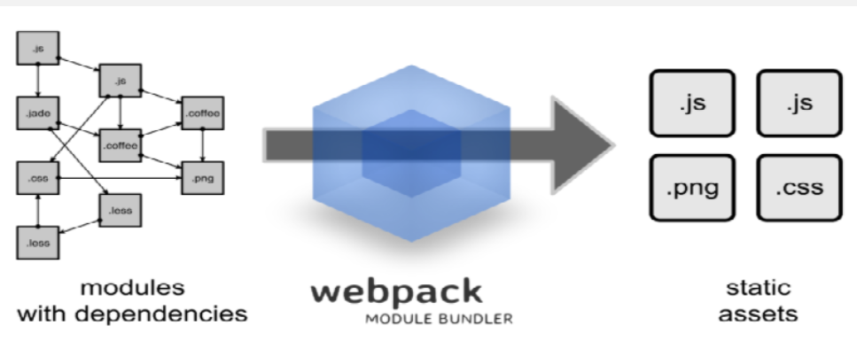

# React + Typescript + Webpack  환경 구성하기 (without CRA)

### 개요

create-react-app 줄여서 CRA인 페이스북에서 제공하는 리액트 보일러플레이트를 사용하여 개발 환경을 구성하는 것이 아닌, webpack을 이용하여 리액트 개발환경을 구성하는 방법에 대해 알아보겠다.

CRA로 개발환경을 구성할 경우 babel 과 webpack 그리고 Typescript등 설정 필요 없이 명령어 하나로 개발에 필요한 환경을 셋팅 할 수 있다.

하지만, CRA에 의존하다 보면, 추후에 Webpack 및 Babel에 추가적인 설정을 해야 할 경우가 생겼을때, 어려움을 겪을 수 있다.

Webpack으로 개발환경을 구성하기전 간단하게 Webpack이 무엇인지에 대해 알아보겠다.

### Webpack 이란?

webpack에 대한 위키백과의 정의 및 개념을 보자면,
웹팩(Webpack)은 오픈 소스 자바스크립트(JS) 모듈 번들러 이다.

웹팩은 의존성이 있는 모듈을 취하여 해당 모듈을 대표하는 정적 자산들을 생성한다.

쉽게 말하자면, webpack은 자바스크립트 모듈 번들러 이다.
이는, 여러개의 나누어져 있는 파일들을 하나의 파일로 만들어 주는 것을 말한다.

#### 그렇다면 왜 webpack과 같은 모듈 번들러를 사용할까?

옛날에는 웹을 구현한다고 할때, js파일수가 많지 않아, 따로 모듈화 할 필요가 없었지만, 점점 시간이 지나, js파일들의 수가 많아 져 중복된 파일 증가, 코드를 불러오기 위한 네트워킹 비용 증가 등 많은 문제들이 등장하기 시작했다.

여기서 만들어진 js파일들 중 중복되는 기능들을 하는 파일들 끼리 하나의 모듈로 만들어 소스코드의 규모를 줄이고, 재사용성을 좋게 하기 위해 모듈화를 한다.



### webpack의 주요 개념

#### 1. Entry

- 애플리케이션의 진입점(entry point) 이다. 리액트 앱이 있는 위치와 번들링 프로세스가 시작되는 지점 이다.
- 웹팩은 엔트리를 통해서 필요한 모듈을 로딩하고 하나의 파일로 묶는다.

#### 2. Output

- 엔트리가 시작점이였다면, 아웃푼은 끝점은 어디로 나와야 하는가 이다.
- 즉 번들링 된 파일에 결과를 제공한다.

#### 3. Loader

- 로더란 번들링 할 파일에 대한 규칙을 정하고, 실행하는 역할을 담당한다.
- 만약, 다른 Type의 파일 (img, font, stylesheet 등)을 웹팩이 이해하고 처리 가능한 모듈로 변환 시키는 작업을 한다.
- 로더는 **test**와 **use** 키로 구성된 객체로 설정할 수 있다.
  - test 에 로딩할 파일을 지정한다.
  - use에 적용할 루더를 설정한다.

#### 4. Plugin

- 로더가 파일 단위로 처리하는 반면 플러그인은 번들된 결과물을 처리한다.
- 플러그인은 번들 최적화, 환경 변수 주입과 같은 작업들을 수행할 수 있으며, 이외에도 다양한 기능들이 존재한다.

웹팩의 주요 기능에 대해 알아보았다면, 이제 CRA 없이 리액트 프로젝트를 실행하는 방법을 알아보겠다.

### 리액트 개발환경 구성하기

#### 프로젝트 디렉토리 생성

```js
mkdir react-webpack-tutorial
cd react-webpack-tutorial
```

프로젝트를 생성하여, 해당 디렉토리로 이동한다.

#### 프로젝트 초기화

해당 디렉토리를 npm  패키지로 바꿀것 이다.

```js
npm init -y
```

기본값으로 package.json 파일이 생성 된다.

#### webpack 세팅

웹팩은 코드와 선택적으로 모든 의존성을 하나의 .js 파일로 묶는 도구이다.

```js
npm install --save-dev webpack webpack-cli
```

설치가 완료 되었다면, webpack 실행에 관한 설정을 하는, webpack.config.js 파일을 root경로에 생성한다.

webpack.config.js 파일에 다음과 같이 코드를 작성해보자.

#### webpack.config.js

```js
const path = require("path");
module.exports = {
   entry: "./src/index.tsx",
output: {
     path: path.join(__dirname, "/dist"),
     filename: "bundle.min.js"
  }
}
```

해당 ./src/index.tsx의 위치는 리액트 앱이 있는 위치와 번들링 프로세스가 시작되는 지점 이다.

또한, 해당 번들링된 파일은 아웃풋의 /dist.bundle.min.js 파일로 추출 된다.

#### Typescript 설치

리액트 프로젝트에서 타입스크립트로 작성하기 위해, 다음과 같이 설치를 진행하자.

```js
npm install --save-dev typescript awesome-typescript-loader
```

웹팩은 일반적으로 javascript 코드만 이해하기 때문에, typescript로 작성된 코드로 작성된 파일을 발견하고, 처리할 수 있도록 하는 awesome-typescript-loader를 설치하자.

설치가 완료 되었다면, tsconfig.json파일을 만들어, typescript 사용 환경을 설정해보자.

루트경로에 tsconfig.json 파일을 생성하고 다음과 같이 작성한다.

#### tsconfig.json

```js
{
  "compilerOptions": {
    "sourceMap": true,
    "noImplicitAny": false,
    "module": "commonjs",
    "target": "es6",
    "lib": [
      "es2015",
      "es2017",
      "dom"
    ],
    "removeComments": true,
    "allowSyntheticDefaultImports": false,
    "jsx": "react",
    "allowJs": true,
    "baseUrl": "./",
    "paths": {
      "components/*": [
        "src/components/*"
      ],
    }
  }
}
```

또한, webpack.config.js에서 모듈을 다음과 같이 설정해야 한다.

#### webpack.config.js

```js
const path = require("path");

module.exports = {
  entry: "./src/index.tsx",
  resolve: {
    extensions: [".ts", ".tsx", ".js"]
  },
  output: {
    path: path.join(__dirname, "/dist"),
    filename: "bundle.min.js"
  },
  module: {
    rules: [
      { 
        test: /.tsx?$/, 
        loader: "awesome-typescript-loader"
      }
    ]
  }
}
```

위와 같이 작성이 완료 되었다면, 리액트로 작성을 하기위해 다음과 같이 설치하자.

```js
npm install --save react react-dom
npm install --save-dev @types/react @types/react-dom
```

@types/react 및 @types/react-dom은 typescript방식으로 사용할 수 있도록 호환성을 제공해 주는 모듈 이다.

이제 간단하게 컴포넌트를 작성해 보겠다.

#### src/components/App.tsx

```js
import * as React from "react";

const App: React.FC = () =>{
    return(
        <div>
            Hello, React with Webpack
        </div>
    );
}

export default App;
```

웹팩에서 entry 경로에 해당하는 index.tsx 파일을 다음과 같이 작성해보자.

#### src/index.tsx

```js
import * as React from "react";
import * as ReactDOM from "react-dom";

import App from "./components/App";

ReactDOM.render(
    <App />,
    document.getElementById("root")
);
```

작성이 완료되었다면, index.html 파일도 다음과 같이 작성하자.

#### src/index.html

```js
<!DOCTYPE html> 
<html lang="en"> 
  <head> 
    <meta charset="UTF-8"> 
    <meta name="viewport" content="width=device-width, initial-scale=1.0"> 
    <meta http-equiv="X-UA-Compatible" content="ie=edge"> 
    <title>TypeScript + React</title> 
  </head> 
  <body> 
    <div id="root"> 

    </div>
  </body>
</html>
```

#### HTML Plugin 추가

웹팩의 번들링 작업이 끝난 후, 나온 html 파일이 자동으로 bundle.min.js 파일을 참조하는 코드를 추가하도록 도와주는 플러그인을 설치해야한다.

```js
npm install --dev html-webpack-plugin
```

해당 플러그인의 설치가 완료되었다면, 다음과 같이 웹팩에 적용 해보자.

#### webpack.config.js

```js
const path = require("path");

const HtmlWebpackPlugin = require("html-webpack-plugin");

module.exports = {
  entry: "./src/index.tsx",
  resolve: {
    extensions: [".ts", ".tsx", ".js"]
  },
  output: {
    path: path.join(__dirname, "/dist"),
    filename: "bundle.min.js"
  },
  module: {
    rules: [
      {
        test: /.tsx?$/,
        loader: "awesome-typescript-loader"
      }
    ]
  },
  plugins: [
    new HtmlWebpackPlugin({
      template: "./src/index.html"
    })
  ]
}
```

위와 같이 웹팩 작성이 완료되었다면, 프로젝트를 실행하기 위해 package.json 파일에 다음과 같이 script 명령어를 추가해보자.

#### 프로젝트 실행을 위해 package.json 파일에 script 명령어 추가

```js
"scripts": { 
  "start": "webpack --mode development", 
  "build": "webpack --mode production" 
}
```

**npm start**명령어를 입력하여 실행하게 되면, 설정한 webpack.config.js 파일과 같이 동작하게 되어, dist 디렉토리와 번들링 된 파일이 생성 된 것을 확인할 수 있다.

이제 마지막으로, 실시간 번들링 작업과 자동 새로고침이 되는 개발용 환경을 구축하기 위해 다음과 같이 모듈을 설치해보자.

#### 개발 환경 구축

```js
npm install --dev webpack-dev-server
```

설치가 완료 되었다면, package.json의 script 명령어를 다음과 같이 변경하자.

```js
"scripts": { 
  "start": "webpack serve", 
  "build": "webpack --mode production" 
}
```

webpack v5에서 부터 webpack-dev-server 실행 명령어가, webpack serve로 바뀌었다.

위와 같이, script 명령어를 변경이 완료 되었다면,
**npm start** 를 입력하여, 프로젝트를 실행하여, localhost:8080으로 접속해 보자.

만약 개발환경에서 기존 포트 번호 8080에서 다른 번호로 변경하고 싶다면, webpack.config.js 파일에 다음과 같이 추가해야한다.

#### webpack.config.js

```js
const path = require("path");

const HtmlWebpackPlugin = require("html-webpack-plugin");

module.exports = {
  // ..동일

  // devServer 포트번호 변경을 위한 추가
  devServer: {
      port:3000
  }
}
```

위와 같이 변경되었다면, 다시 프로젝트를 실행하여, localhost:3000 포트번호로 접속해보자.

### 마치며

리액트 개발 환경을 페이스북에서 제공하는 보일러플레이트인 CRA이 아닌 Webpack을 이용하여 직접 리액트 개발환경을 구성하는 법에 대해 알아보았다.
