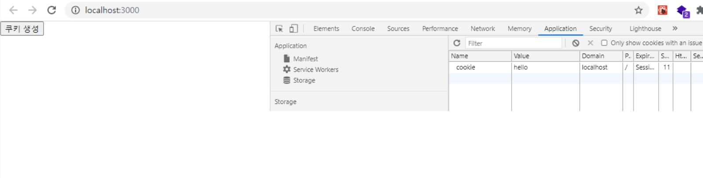

# 리액트에서 쿠키 및 스토리지 활용하기

### 개요

클라이언트에서 데이터를 관리하는 방법인 쿠키 및 스토리지에 대해서 알아보도록 하며, 간단한 예제를 통해서, 리액트 프로젝트에서 쿠키를 어떻게 사용하는지에 대해 알아보자.

먼저, 리액트 프로젝트에 쿠키를 사용하기 전에, 쿠키 및 스토리지에 대해서 간략히 알아보도록 하자.

### 쿠키, 스토리지란 무엇인가?

이에 대해 설명하기전 간단하게 HTTP 프로토콜에 대해 간단한 특징을 살펴 보자.

#### HTTP 프로토콜의 특징

- 비연결지향 (Connectionless) : 클라이언트가 서버에게 Request(요청)을 보내고 서버가 클라이언트에게 Response(응답) 를 보내면 접속을 종료한다.
- 무상태 (Statelistt) : 통신이 끝나면 상태 정보를 유지하지 않는다.

클라이언트의 로그인 등의 정보나, 브라우저에서 입력한 값 등이 페이지를 이동할 때마다, 초기화 되기때문에, 이러한 문제점을 해결하기 데이터 저장에 사용 하는 것이, 쿠키, 스토리지 이다.

### 쿠키

- 클라이언트가 서버에 방문한 정보를 클라이언트 단에 저장하는 작은 파일을 의미한다.
- 브라우저 요청이 있을 경우 자동으로 서버에 전송 한다. 그렇기에, 쿠키의 크기가 클수록 서버에 부담이 갈수 있다.
- SameSite 옵션이 Strict가 아닌경우, 다른 도메인에서 요청할 때도 자동 전송이 되는 위험성이 있다. 이는 CSRF에 취약 하다는 점이 있다.
- 하나의 쿠키는 4KB 까지 저장이 가능하다.

쿠키는 크게 두가지로 분류 할 수 있다.

**Session Cookie** : 클라이언트가 종료되면 삭제되는 휘발성 쿠키
**Permanent Cookie** : 클라이언트가 종료되어도 일정 기간 유지되는 쿠키

만약, 쿠키 정보를 브라우저에 저장할때, expires을 설정하여 쿠키가 자동으로 삭제되는 기간을 입력해 주어야 한다.

만약 설정이 되지않은 경우, 브라우저가 종료되면 자동으로 삭제 된다.

#### 스토리지는 Local Storage와 Session Storage 로 분류 된다

스토리지는 서버가 아닌 클라이언트에 데이터를 저장할 수 있도록 지원하는 HTML5의 기능이다.

스토리지의 기능은 다음과 같다.

- 스토리지는 쿠기의 단점을 보완해서 만든 기술 이다.
- 키 (KEY)와 값(Value)의 형태로 데이터를 저장한다.
- 서버에 전송되지 않으므로 서버에 부담이 가지않는다.
- 쿠키와 달리, 대략 5MB 까지의 데이터를 저장할 수 있으며, 유효기간은 존재하지 않는다.
- 쿠키와 달리 필요한 경우에만 꺼내 쓰는 것으로 자동 전송의 위험성이 없다. 다른 도메인에서 요청하는 경우에는, 꺼내 쓰고 싶어도 도메인 단위로 접근이 제한되는 특성 덕분에 값을 꺼내 쓸수 없다. (CSRF 안전)

### Local Storage (로컬 스토리지)

- window.localStorage 객체
- 브라우저를 종료해도 유지되는 데이터로, 명시적으로 지우지 않는 한 영구적으로 저장된다.
- 도메인 별로 생성되며, 다른 도메인의 로컬 스토리지에는 접근이 불가능하다.
- 서로 다른 브라우저 탭이라도 동일한 도메인이라면 동일한 로컬 스토리지를 사용한다.
- 지속적으로 필요한 정보를 저장하기에 좋다. (자동로그인)

### Session Storage (세션 스토리지)

- window.sessionStorage 객체
- window 객체와 동일한 유효 범위 및 생존기간을 가지며, 탭/윈도우를 닫을 시 데이터가 삭제된다.
- 서로 다른 세션 스토리지는 서로 영향을 주지 않으며 독립적으로 동작한다.
- 잠시동안 필요한 정보를 저장하기에 좋다. (입력 폼 저장, 일회성 로그인 등)

이와 같이 간단하게, 쿠키와 로컬스토리지, 세션스토리지에 대해 간단히 알아보았다.

그렇다면 이제, 리액트 프로젝트에 쿠키를 사용하는 법에 대해 알아보자.

### 리액트 프로젝트에 쿠키 사용하기

우선 CRA 또는 Webpack으로 프로젝트를 생성하자.

나는 편하게 CRA으로 프로젝트를 생성 하였다.

이제, 리액트 프로젝트에서 쿠키를 사용하기 위해 react-cookie 라이브러리를 설치 해준다.

```js
npm install react-cookie
```

설치가 완료 되었다면, 먼저 App 컴포넌트에 다음과 같이 변경 해보자.

#### src/App.tsx

```js
import CookieComponent from "./components/CookieComponent";
import {CookiesProvider} from "react-cookie"; //추가
function App() {
  return (
      <CookiesProvider>
          <CookieComponent />
      </CookiesProvider>
  );
}

export default App;

```

CookiesProvider를 import 해오고, CookieComponent를 감싸준다.

이제 CookieComponent를 다음과 같이 작성하자.

#### 쿠키 생성(cookies.set)

#### src/components/CookieComponent.tsx

```js
import React from "react";
import {withCookies, ReactCookieProps} from "react-cookie";


interface Props extends ReactCookieProps{}
const CookieComponent: React.FC<Props> = ({cookies}) =>{
    
    const createHandler = () =>{
        cookies?.set("cookie","hello");
    }
    return(
        <div>
            <button onClick={createHandler}>쿠키 생성</button>
        </div>
    );
}

export default withCookies(CookieComponent);
```

위의 코드는 쿠키 생성 버튼을 클릭했을때, 브라우저의 쿠키에 저장하는 예제 이다.

쿠키 저장하는 방법은 set을 통해서 저장한다.

여기서 **cookie** 는 Key 이며, **hello** 는 Value 이다.

이제 프로젝트를 실행한 후, 쿠키 생성 버튼을 눌러보자.



다음과 같이 쿠키에 저장된 모습을 확인 할 수 있다.

쿠키 확인 방법은 F12 콘솔창을 열어서, Application을 클릭한 후, Cookies에서 확인할 수 있다.

그렇다면 쿠키 값을 가져오는 방법은 어떻게 할까?

다음 코드를 확인해 보자.

#### 쿠키 가져오기 (cookies.get)

#### src/components/CookieComponent.tsx

```js
import React from "react";
import {withCookies, ReactCookieProps} from "react-cookie";


interface Props extends ReactCookieProps{}
const CookieComponent: React.FC<Props> = ({cookies}) =>{
    
    const createHandler = () =>{
        cookies?.set("cookie","hello");
    }
    return(
        <div>
            <button onClick={createHandler}>쿠키 생성</button>
            // 추가
            <p>{cookies?.get("cookie")?cookies?.get("cookie"):"쿠키없음"}</p>
        </div>
    );
}

export default withCookies(CookieComponent);
```

위와 같이 cookies.get을 통하여 쿠키값을 가져올 수 있다.

cookie는 이전에 쿠키 데이터를 저장할때의 key값 이다.

만약 쿠키가 없다면, 쿠기 없음 이라고 나올 것이다.

마지막으로 쿠키를 삭제하는 방법은 다음과 같다.

#### 쿠키 삭제 (cookies.remove)

#### src/components/CookieComponent.tsx

```js
import React from "react";
import {withCookies, ReactCookieProps} from "react-cookie";


interface Props extends ReactCookieProps{}
const CookieComponent: React.FC<Props> = ({cookies}) =>{
    
    const createHandler = () =>{
        cookies?.set("cookie","hello");
    }
    
    //추가
    const removeHandler = () =>{
        cookies?.remove("cookie");
    }
    return(
        <div>
            <button onClick={createHandler}>쿠키 생성</button>
            // 추가
            <button onClick={removeHandler}>쿠키 삭제</button>
            <p>{cookies?.get("cookie")?cookies?.get("cookie"):"쿠키없음"}</p>
        </div>
    );
}

export default withCookies(CookieComponent);
```

위와 같이 cookies.remove를 사용하여 삭제한다.

동일하게, remove에는 key값으로 삭제가 수행된다.

위의 코드 작성이 완료되었다면, 프로젝트를 실행해서 확인해보자.

쿠키 생성 및 삭제가 잘 진행 된다, 또한 새로고침도 해보자.

하지만 이전에 쿠키에 대한 특징을 알아 보았을때, 쿠키는 크게 2가지로 분류 된다고 하였다.

**Session Cookie** : 클라이언트가 종료되면 삭제되는 휘발성 쿠키
**Permanent Cookie** : 클라이언트가 종료되어도 일정 기간 유지되는 쿠키

지금까지 코드는 클라이언트가 종료되면 삭제되는 휘발성 쿠키 이다.
그렇다면, expires(만료기간) 을 설정하여, 일정 기간 유지되도록 만들어 보겠다.

```js
import React from "react";
import {withCookies, ReactCookieProps} from "react-cookie";


interface Props extends ReactCookieProps{}
const CookieComponent: React.FC<Props> = ({cookies}) =>{
    
    const createHandler = () =>{
        const today = new Date(); //추가
        today.setDate(today.getDate()+1); //추가
        //변경
        cookies?.set("cookie","hello", {expires:today}); 
    }

    const removeHandler = () =>{
        cookies?.remove("cookie");
    }
    return(
        <div>
            <button onClick={createHandler}>쿠키 생성</button>
            <button onClick={removeHandler}>쿠키 삭제</button>
            <p>{cookies?.get("cookie")?cookies?.get("cookie"):"쿠키없음"}</p>
        </div>
    );
}

export default withCookies(CookieComponent);
```

위와 같이 쿠키를 생성할 때,  현재 시간에서 1 day를 더한 후,  expires 로 설정하였다.

그러면 쿠키를 생성 후, 콘솔 창에서 확인해보자.

기존에는 Expires가 session으로 저장되었다면, 이번에는 하루 뒤 날짜로 설정 되었다.

이렇게 설정이 완료 되었다면, 이 쿠키값은 브라우저가 종료 되어도, 설정된 시간까지 계속 남아 있게 된다.

추가로, 로컬스토리지 및 세션스토리지를 사용하는법에 대해 간단히 살펴 보겠다.

위의 코드에 추가로 작성하여, 다음과 같이 작성해보자.

#### src/components/CookieComponent.tsx

```js
import React from "react";
import {withCookies, ReactCookieProps} from "react-cookie";


interface Props extends ReactCookieProps{}
const CookieComponent: React.FC<Props> = ({cookies}) =>{
    
    const createHandler = () =>{
        const today = new Date();
        today.setDate(today.getDate()+1);

        cookies?.set("cookie","hello", {expires:today});
        
        // 로컬스토리지 및 세션스토리지 추가
        window.localStorage.setItem("localStorage", "this is localStorage");
        window.sessionStorage.setItem("sessionStorage", "this is sessionStorage");
    }


    const removeHandler = () =>{
        cookies?.remove("cookie");
        // 로컬스토리지 및 세션스토리지 추가
        window.localStorage.removeItem("localStorage");
        window.sessionStorage.removeItem("sessionStorage");
    }
    return(
        <div>
            <button onClick={createHandler}>쿠키 생성</button>
            <button onClick={removeHandler}>쿠키 삭제</button>
            <p>쿠키 Data : {cookies?.get("cookie")?cookies?.get("cookie"):"쿠키없음"}</p>
            
            // 로컬스토리지 및 세션스토리지 추가
            <p>로컬스토리지 Data : {window.localStorage?.getItem("localStorage")?window.localStorage?.getItem("localStorage"):"로컬스토리지 없음"}</p>
            <p>세션스토리지 Data : {window.sessionStorage?.getItem("sessionStorage")?window.sessionStorage?.getItem("sessionStorage"):"세션스토리지 없음"}</p>
        </div>
    );
}

export default withCookies(CookieComponent);
```

로컬스토리지 및 세션스토리지는 쿠키와 사용법이 동일하다.
하지만 쿠키와 같이 만료시간(expires)를 설정할 수 없으며, 오로지 Key, Value로만 구성 되어있다.

또한 스토리지 같은 경우에는, 쿠키와 같이 라이브러리를 설치 할 필요가 없으며, window 객체를 사용한다.

그렇다면 위와 같이 코드 작성이 완료 되었다면, 프로젝트 실행 후 브라우저에서 확인해보자.

또한, 브라우저를 종료한 후 새로 브라우저를 열어, 쿠키 및 로컬스토리지, 세션스토리지가 어떻게 작동하는지 살펴보자.

### 마치며

이번 포스트에서는 클라이언트에서 데이터를 관리하는 방법인 쿠키, 로컬스토리지, 세션스토리지에 대한 특징에 대해 알아본 후, 리액트에서 어떻게 사용하는지에 대해 간단히 알아보았다.
