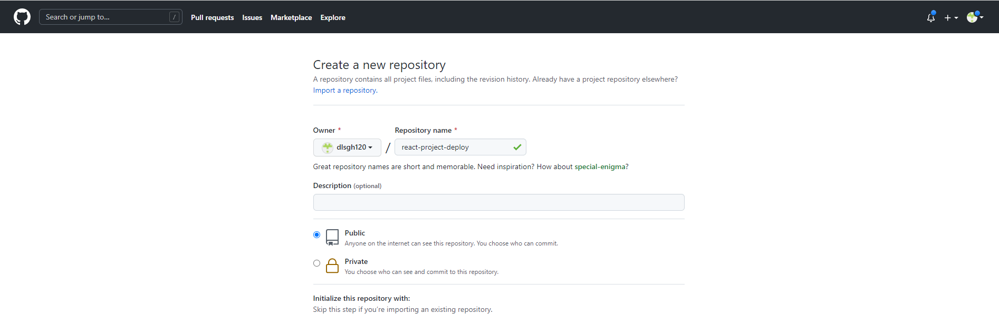
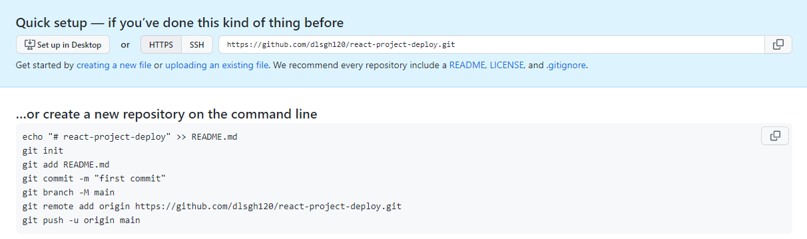

# 리액트 프로젝트 github pages에 배포하기

### 개요

완성된 리액트 프로젝트를 github pages에 배포하는 법에 대해 알아보겠다.

기존에는 localhost:3000 등 로컬 환경에서 완성된 프로젝트를 확인 하였는데, 다른 사람들이 볼 수 있도록, 배포하는 법에 대해 간단히 알아보겠다.

### 프로젝트 생성

배포를 위해서, CRA환경으로 프로젝트를 하나 생성 하였다.

```js
npx create-react-app react-project-deploy
```

### 로컬 저장소에 commit 하기

CRA 으로 리액트 프로젝트를 생성하셨다면, 기본적으로 git 저장소가 생성 된다.

만약 git 저장소가 없다면 다음 명령어를 입력해야한다.

```js
git init
```

이제 리액트 프로젝트의 파일 및 폴더의 추가 및 변경 사항을 로컬 저장소에 기록을 하기 위해, 다음과 같이 명령어를 입력하자.

```js
git add .
git commit -m "first commit"
```

### github 레파지토리 생성

깃허브에 들어가서 다음과 같이 레파지토리를 생성하자.



레파지토리 이름을 react-project-deploy 으로 생성 하였다.
이름은 마음대로 생성 할 수 있지만 이 이름을 기억 하고 있어야 한다.

생성이 완료 되었다면, 깃 레파지토리와 로컬 저장소를 연결해 주어야 한다.

```js
git remote add origin https://github.com/dlsgh120/react-project-deploy.git
```

위의 명령어를 확인 해보면, 뒤에 주소가 있을 것이다.

이 주소는 깃 레파지토리 생성 하면 다음 이미지와 같이 주소를 확인 할 수 있으며, 해당 주소를 입력 해야한다.



이제 다음 명령어를 입력하여, 연결 잘 되었는지 확인 할 수 있다.

```js
git remote -v
```

정상적으로 연결이 완료 되었다면, 다음과 같이 모습을 할 수 있다.

```js
origin  https://github.com/dlsgh120/react-project-deploy.git (fetch)
origin  https://github.com/dlsgh120/react-project-deploy.git (push) 
```

이제 마지막으로, 해당 로컬 저장소에 대한 저장 내용을 github에 저장하기 위해 다음과 같이 명령어를 해보자.

```js
git push origin master
```

이제 레파지토리를 확인해보자. 추가 및 변경된 사항들이 잘 저장 되었을 것이다.

### 배포를 위한 모듈 설치

이제 배포를 위한 모듈을 설치하겠다.

다음과 같이 설치를 진행 하자.

```js
npm install --save-dev gh-pages
```

### 배포를 위한 package.json 내용 추가

위와 같이 gh-pages 모듈 설치가 완료 되었다면, 이제 package.json 파일에 다음과 같이 내용을 추가 해야한다.

#### package.json

먼저, homepage 내용을 다음과 같이 추가 한다.

홈페이지 내용은 **https://[github id].github.io/[git repository name]**

```js
{
  // ...내용 동일
  "browserslist": {
    "production": [
      ">0.2%",
      "not dead",
      "not op_mini all"
    ],
    "development": [
      "last 1 chrome version",
      "last 1 firefox version",
      "last 1 safari version"
    ]
  },
  //추가
  "homepage": "https://dlsgh120.github.io/react-project-deploy"
}

```

반드시, homepage 에 본인의 깃헙 아이디와, 레파지토리 이름을 입력하자.

그리고, 배포를 위해 package.json 파일에 방금 설치한 gh-pages 모듈에 대한 내용을 script안에 다음과 같이 작성해야 한다.

```js

{
// ..동일

"scripts": {
    "start": "react-scripts start",
    "build": "react-scripts build",
    "test": "react-scripts test",
    "eject": "react-scripts eject",
    // 추가
    "deploy": "npm run build && gh-pages -d build"
  }
}

//..동일
```

위와 같이, homepage 내용과 scripts 안에 deploy에 대한 내용이 추가 되었다면, 다음과 같이 명령어를 입력하자.

```js
npm run deploy
```

완료 되었다면, package.json 에서 설정한 homepage 주소로 들어가보자.

나의 리액트 프로젝트 배포된 주소는 [https://dlsgh120.github.io/react-project-deploy](https://dlsgh120.github.io/react-project-deploy) 에서 확인 할 수 있다.

### 마치며

리액트 프로젝트를 Github Pages에 배포하는 방법에 대해 알아보았다.

# 블로그 링크

> https://dlsgh120.tistory.com/57
