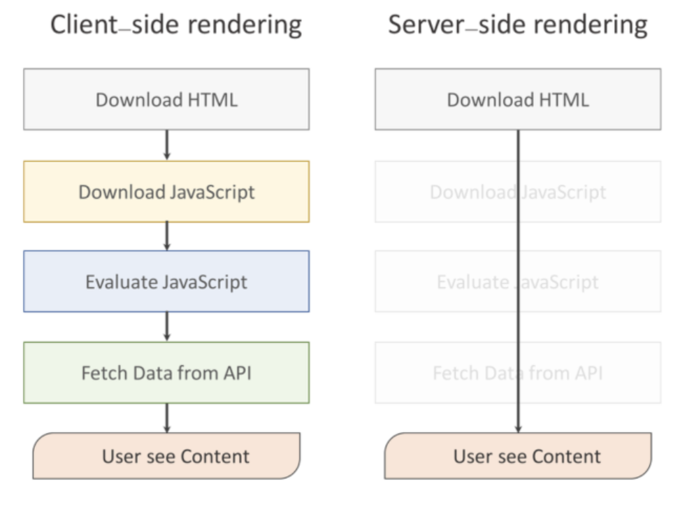

# SSR 과 CSR 그리고, Next.JS에 대해 알아보기

### 개요

리액트의 서버사이트렌더링를 도와주는 프레임워크인 Next.js 에 대한 개념 및, 주요기능 그리고 간단한 세팅방법에 대해 알아보도록 하자.

React도 Server-Side-Rendering을 고려하여 설계 되었기 때문에, 자체적으로 구현이 가능하지만, 개발환경을 만들기 위해서는 생각보다 복잡하다.

하지만 이러한 복잡한 문제들을 Next.js를 사용하여 아주 쉽게 해결할 수 있다.

그렇다면 SSR이 무엇이며, 왜 사용할까?

### SSR vs CSR

**SSR**은 전통적인 웹 어플리케이션 렌더링 방식으로 사용자가 웹 페이지에 접근 할때, 서버에 페이지에 대한 요청을 한다.

서버는 HTML, View와 같은 리소스 들을 어떻게 보여줄지 해석하고, 렌더링 하여 사용자에게 반환 한다.

이때, 웹서버에 요청할 때 마다 브라우저에서 새로고침이 일어나고 서버에 새로운 페이지에 대한 요청을 하는 방식 이다.

**CSR**에 대해 알아보기 전 간단하게 **SPA**에 대해 알아 보자.

#### SPA란?

기술이 발전하여 모바일의 사용량이 늘어 남에 따라 모바일 환경에 최적화 된 서비스가 필요해 졌다.

하지만, 일반적인 컴퓨터에 비해 성능이 낮은 모바일에 최적화 시키는 일은 어려운 일이였으며, 기존 SSR과 다른 방식이 필요했으며, 이를 위해 등장한 개념이 SPA 이다.

**SPA**는 최초 한번 페이지 전체를 로딩한 이후 부터는 데이터만 변경하여 사용하는 단일 페이지로 구성된 웹 어플리케이션 이다.

SPA에서는 화면 구성에 필요한 모든 HTML을 클라이언트가 가지며, 서버 측에는 필요한 데이터를 요청하고 JSON으로 받기 때문에, 기존 어플리케이션에 비해 화면 전환 등 구성하는 속도가 빠르다.

전통적인 렌더링 방식인 SSR은 SPA에 비해 성능이 뒤떨어 졌다.

그 이유는 페이지를 요청할 때마다 서버로 부터 자원을 받아 해석한 후, 화면에 렌더링을 했기 때문이다.

이러한 단점을 보완하고자 SPA는 트래픽을 감소시키고 사용자에게 최적화된 환경을 제공할 수 있게 되었다.

서버에서는 JSON파일을 보내는 역할만 하며, HTML을 그리는 역할은 클라이언트 측에서 Javascript가 수행하도록 하는 방식이 CSR 이다.

그렇다면, SSR 및 CSR 각각의 장단점에 대해 알아보자.

### SSR의 장점

#### - 검색엔진최적화(SEO) 가능

SSR의 가장 큰 장점 중 하나이다.

#### - 초기로딩속도가 빠름

처음 렌더링 된 HTML을 클라이언트에게 전달 해 주기 때문에, 초기 로딩 속도를 줄일 수 있다.

또한, Javascript파일을 불러오고 렌더링 작업이 완료 되지 않아도 사용자가 콘텐츠를 이용 할 수 있다.

### SSR의 단점

#### - 프로젝트 구조가 복잡해짐

단순히 렌더링만 한다면 문제가 발생하지 않지만, Redux 및 Mobx 등 여러 라이브러리와 함께 사용하여, 서버에서 데이터를 가져와 렌더링하는 경우가 발생할 때, 구조가 복잡해진다.

#### - 새로고침이 발생

서버에 요청을 할때마다, 새로고침이 발생하기 때문에 서버에 부담이 발생한다.

### CSR의 장점

#### - 트래픽 감소 및 빠른 화면 전환

SSR 같은 경우에, 페이지 전환 시, 새로고침이 발생되어, 서버에 부담을 주는 것에 반해, CSR는 사용자의 행동에 따라 필요한 부분만 다시 읽어 들이기 때문에 서버측에 전체 페이지를 다시 읽어 들이는 것보다 빠른 인터랙션이 가능하다.

즉, 필요한 부분에 대한 데이터만 받아 올 수 있기 때문에, 서버에 대한 부담을 줄일 수 있다.

### CSR의 단점

#### - 초기 구동 속도가 느리다

SSR은 View를 서버에서 렌더링 하여 가져오기 때문에, 초기 구동 속도가 빠름에 비해, CSR는 서버에서 View를 렌더링 하지 않는다.

CSR는 HTML, Javascript 파일 등 각종 리소스를 다운로드 한 후에 브라우저에서 렌더링을 하기 때문에 초기 구동 속도가 느리다.

#### - 검색엔진최적화(SEO)가 어려움

CSR방식으로 이루어진 경우에는 View를 그리기 위해서는 Javascript를 실행 시켜야 한다.

하지만, 크롤러 봇 들은 Javascript 파일을 실행하지 못하기 때문에, 빈 화면으로 인식하게 된다.

#### - 보안 문제

SSR은 사용자 정보를 서버측에서 세션으로 관리하지만 CSR은 쿠키 말고는 사용자 정보를 저장할 공간이 마땅치 않다.

이제, SSR와 CSR 에 대해 알아 보았으니, Next.js의 핵심 기능에 대해 알아보자.

### Next.js의 핵심기능

#### 1. 코드 스플리팅

일반적인 리액트 SPA는 초기 렌더링시 모든 컴포넌트를 내려 받는다.

그렇기에 프로젝트의 규모가 커지고, 용량이 커질 수록 로딩 속도가 지연 될 수 있다. 또한, 현재 필요하지 않는 페이지 정보까지 다 내려 받기때문에 비효율적이다.

이러한 문제점을 해결하기 위해 Next.js는 코드 스플리팅을 지원 한다.

Next.js의 폴더 구조를 보면 pages 폴더 안에 각 page가 들어있으며, 이 page는 라우트 역할을 한다.

예를 들어, 브라우저가 실행 되고, 사용자가 해당 주소로 접근을 하면, index page가 불러지고 페이지 이동에 따라 해당 페이지에 관련된 컴포넌트만 불러오게 된다.

#### 2. 간단한 클라이언트 사이드 라우팅 제공

Next.js는 간편한 라우팅을 제공해 준다. 사용 방법은 Router, Link를 import 하여 사용 할 수 있다.

기존 React 프로젝트에서는 React-router의 Link를 import하여 사용 하였으며, Link의 경로는 to로 사용하였지만, Next.js는 href를 사용하여 해당 페이지로 이동을 수행한다.

또한, as는 href의 URL를 조금 더 직관적으로 만들어 주는 역할을 한다.

Router는 Link와 마찬가지로 해당 페이지로 이동시키는 역할을 하는데, 개발자에게 제어권을 좀더 넘겨 주어 Redirect도 쉽게 가능하다.

#### 3. 커스텀 API 서버 (as - 라우트 마스킹)

Next는 커스텀 서버를 통해 라우트 마스킹을 할 수 있다.
이는 Express나 Node.js와 같은 http 서버와 함께 구현이 가능하다.

만약 Link 컴포넌트에서 as를 사용하여, 실제 페이지가 없는 곳으로 작성 하였다면, 직접 커스텀 서버를 생성하여 as의 URL이 href를 바라 볼 수 있도록 처리하여 구성 할 수 있다.

#### 4. data-fetching

기존 Next.js에서 page폴더 아래에 있는 엔드포인트 js에서 데이터를 가져올때, getInitialProps로 가져왔던 것들을 서버사이드와 SSG(Static Generation)으로 나누어 쓰도록 만들었다.

이 방법에 대해 자세한 내용은 추후 포스트에서 다룰것이다.

기본적으로 Next.js는 모든 페이지를 pre-rendering하는 기법을 취하고 있다. 즉 view가 렌더링 되기 전에 미리 서버에서 데이터를 fetch하기 때문에, 실제 화면을 보여주는 과정에서는 따로 데이터 fetch 작업 없이 렌더링만 시켜주기 때문에 속도가 빨라질 수 있다.

Next.js 에 대해 알아보았다.

이제 Next.js를 간단하게 세팅 및 사용법에 대해 알아보자.
