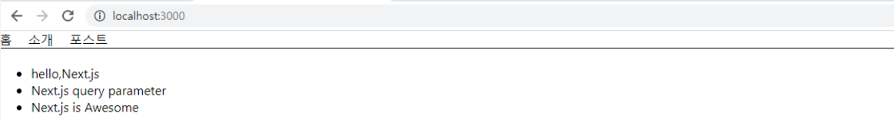

# Next.js Dynamic URl 사용해보기

### 개요

저번 포스트 내용을 이어서 URL을 동적으로 사용하는 방법에 대해 알아보자.

Next.js 에서 Route에 대한 내용을 못봤더라면 [Tistory](https://dlsgh120.tistory.com/59)  또는 [Github](https://github.com/dlsgh120/blog-contents/tree/main/react/25-Nextjs-%EB%9D%BC%EC%9A%B0%ED%8C%85%EB%B0%8F%EA%B3%B5%EC%9A%A9Component)에서 확인 할 수 있다.

지금 까지 정적(static)으로 라우트를 다루었지만, 이번에는 조금 더 깊게 동적(dynamic)하게 다루어 보자.

실제 앱에서는 동적인 컨텐츠를 표시하기 위해 페이지를 동적으로 만들어야 한다.

Next.js에서는 **query 파라미터**와 **Pathname 파라미터**를 사용 한다.
그렇다면, query 또는 pathname 파라미터란 무엇일까?

### 쿼리 파라미터

쿼리 파라미터는 기본적으로 /post?title=Hello,Next.js 와 같은 형태를 지니고 있다.

간단한 예제를 통해 살펴보자. 예제코드는 이전 포스트에서 다룬 코드를 가지고 진행 할 것이다.

딱히, 라이브러리를 설치 할 필요가 없고, Next 프로젝트만 설치하면 되기 떄문에, 여기서 샘플코드는 실제 사용된 컴포넌트만 폴더로 생성 할 것이다.

우선 pages폴더 내부에 있는 index.tsx 파일을 다음과 같이 추가해보자.

#### pages/index.tsx

```js
import Layout from "../components/Layout";
import Link from "next/link";

const PostLink = (props:{title:string}) =>{
  return(
    <li>
        <Link href={`/post?title=${props.title}`}>
            <a>{props.title}</a>
        </Link>
    </li>
  );
}
const Home = () =>{
  return (
        <Layout>
            <ul>
                <PostLink title="hello,Next.js" />
                <PostLink title="Next.js query parameter" />
                <PostLink title="Next.js is Awesome" />
            </ul>
        </Layout>
  )
}

export default Home;
```

프로젝트를 실행 후, 브라우저에서 확인하면, 다음과 같이, 3개의 링크가 생긴 index 화면을 확인 할 수 있다.



링크를 클릭해 보면, 아직 404 에러가 발생 할 것 이다.
그 이유는, 아직 링크를 클릭 했을 때 라우팅 되는 page를 생성하지 않았기 때문이다.

이제 pages폴더 내부에 post.tsx 파일을 다음과 같이 작성하자.

#### pages/post.tsx

```js
import Layout from "../components/Layout";
import {useRouter} from "next/router";

const Post = () =>{
    const router = useRouter();

    return(
        <Layout>
            <h1>{router.query.title}</h1>
        </Layout>
    )
}

export default Post;
```

위와 같이 작성이 완료 되었다면, 브라우저에서 링크들을 클릭하여, post 페이지가 잘 나오는지 확인해보자.

url을 확인해보면,  `/post?title=hello,Next.js ` 형식으로, title이라는 query가 생성 된 것을 확인 할 수 있다.

useRouter를 통해 Next.js의 router 객체를 변수에 담은 후, router 객체 안의 query에서 필요한 값인 title 값을 가져와, 해당 query인 title 값을 화면에 렌더링 되도록 한 것이다.

다시 home으로 가서 2번째 및 3번째 링크를 클릭해보자.

그러면 화면에 query인 title에 해당하는 값이 잘 나올 것 이다.

하지만, url 주소를 확인 해보면, `http://localhost:3000/post?title=Next.js%20query%20parameter` 이렇게 %20와 같이 나올 것 이다.

url에 잘못된 값으로 경로가 입력된 것이 아니라, title에 띄어쓰기가 들어가 있어서 url에서는 %20으로 변경 되어 들어 간 것이다.
