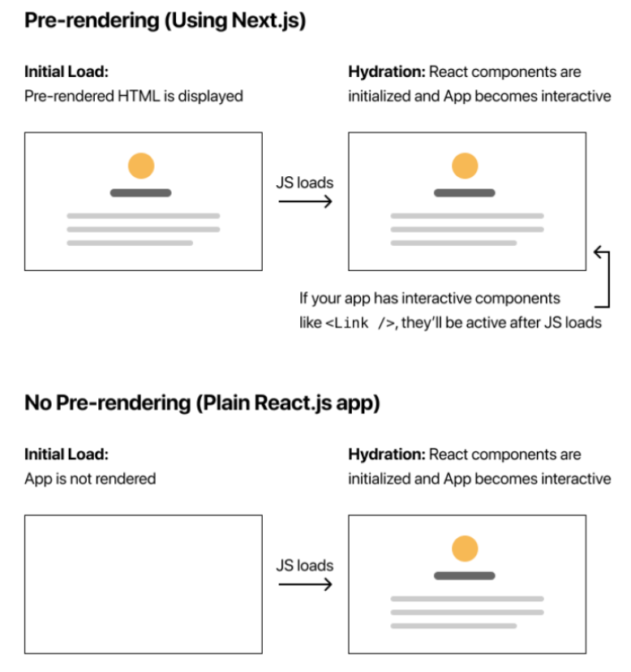
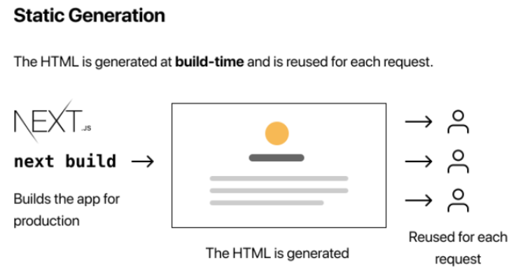
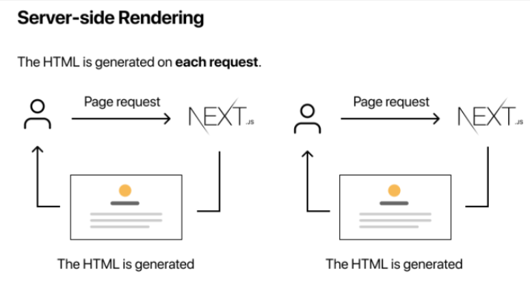

# Next.js 외부 Data 가져오기(Fetching)

### 개요

이번 포스트는 이전 포스트의 내용에서 이어 설명하기 때문에, 저번 포스트에 대한 내용을 읽지 않았다면 [Tistory](https://dlsgh120.tistory.com/60) 또는 [Github](https://github.com/dlsgh120/blog-contents/tree/main/react/26-Next-Dynamic-URL)에 작성된 글을 먼저 보도록 하자.

Next.js 9.3 이전 버전 까지는 Data Fetching을 하기 위해 getInitialProps 하나로 사용 되었지만, 이후 버전 부터는 **getStaticProps**, **getStaticPaths**, **getServerSideProps** 세가지로 세분화 되었다.

이 세가지에 대해 알아보기 전, Next.js 의 중요한 컨셉중 하나인 Pre-rendering에 대해 먼저 살펴 보겠다.

### Pre-rendering

기본적으로 Next.js의 모든 페이지는 Pre-rendering 되는데, 이것은 Next.js가 각각의 HTML 페이지를 생성한다는 것을 의미 한다.

그렇기에 Pre-rendering은 보다 더 좋은 성능과 SEO를 자랑한다.

React와 같은 Client-side Rendering은 각각의 페이지를 생성하는 것이아닌, 페이지에 있는 데이터를 Javascript가 그려 준다.

각각의 생성된 HTML은 각 페이지에 필요로 하는 최소한의 Javascript로 이루어 져 있으며, 브라우저에서 페이지를 불러올 때 Javascript 코드가 실행 되며 인터렉티브를 생성 한다.

Javascript 코드가 동작하면서 인터렉션을 생성하는 과정을 hydration 이라 부른다.

순수 React 앱이라면 Pre-rendering이 되지 않기 때문에, Javascript를 disable(비활성화) 시키면 아무것도 볼 수 없을 것이다.

### Pre-rendering VS No Pre-rendering

아래 그림을 보며 차이점을 살펴보자.

### 두가지 방식의 Pre-rendering

Next.js는 두가지 형태의 Pre-rendering 방식이 있다. 이는 페이지에 대한 HTML을 언제 생성하는지에 따라 차이가 있다.

#### 1. Static Generation

빌드 시 HTML를 생성하며, 각 요청에 따라 재 사용 된다.

#### 2. Server-side Rendering

각 요청에 따라 HTML를 생성한다.

위와 같이 Next.js에서는 각각의 페이지에 대해 어떠한 Pre-rendering 방식을 사용할 지 결정 할 수 있다.

### 그렇다면 언제 Static Generation과 Server-side Rendering을 사용 할까?

우선 Server-side Rendering 방식 보다 Static Generation 방식이 빠르다.

그 이유는 매번 서버가 모든 요청에 대해 페이지를 렌더링 하는 것 보다는 빌드 시 HTML를 생성하기 때문에 미리 만들어 져 있는 페이지를 볼 수 있다.

하지만 무조건 빠르기 때문에 Static Generation 방식을 사용 하는 것은 아니다.

Static Generation 방식은 주로 **마케팅**, **블로그 포스트** 등 정적인 페이지를 생성 할때 사용하는 것이 올바르다.

그렇기에 어떠한 방법을 사용할지는 스스로 판단을 하고 상황에 맞게 사용하는 것이 바람직하다. (사용자 요청하기 전에 페이지를 미리 생성해 두어도 되는 것인지)

만약, 데이터가 업데이트 되거나, 컨텐츠가 매 요청마다 달라지는 경우는 Server-side Rendering 방식을 사용해야한다.

이는 조금 느리지만, 항상 최신의 데이터를 보여준다.

이제, Next.js에서 Pre-rendering에 대해 알아보았으니, 이를 어떻게 사용하는지에 대해 알아보자.
