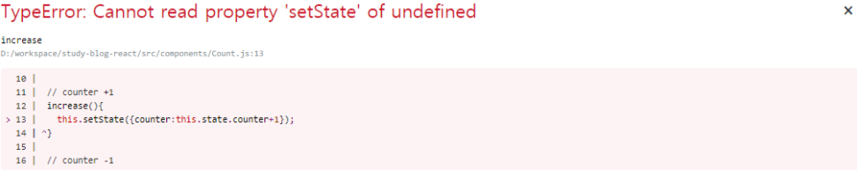

# 리액트 컴포넌트의 이벤트 연결(Binding)에 대하여

## 개요

이번 포스트에서는 React 컴포넌트에 이벤트를 연결하는 바인딩하는 법에 대해 알아 보겠습니다.
바인딩에 대해 알아보기전 javascript의 this의 개념에 대한 이해도가 필요합니다. 그 이유는 바인딩은 React만의 특수한 동작이 아니고, javascript에서 함수가 작동하는 방식이기 때문입니다.

> 참조: [https://ko.reactjs.org/docs/faq-functions.html](https://ko.reactjs.org/docs/faq-functions.html)

## javascript 에서의 binding

```js
var obj = {
  title: "hello world",
  sayHello: function () {
    console.log(this.title);
  },
};

obj.sayHello(); // hello world
```

코드가 작동하면, 위의 결과는 console 에 "hello world"가 출력됩니다.

그러면 다른 예제 코드를 보겠습니다.

```js
var obj = {
  title: "hello world",
  sayHello: function () {
    console.log(this.title);
  },
};

var reference = obj.sayHello;
reference(); // undefined
```

이 코드의 결과는 어떻게 될까요?
결과는 undefined로 나올 것입니다. 그 이유는 reference의 변수에 담길때, obj와의 관계가 상실되기 때문입니다.
이와같은 상황에서 필요한 것이 binding 입니다.

javascript 에서 올바른 binding 사용은 다음과 같습니다.

```js
var obj = {
  title: "hello world",
  sayHello: function () {
    console.log(this.title);
  },
};

var reference = obj.sayHello.bind(obj);
reference(); // hello world
```

이와 같이 reference의 변수에 담을때, obj를 바인딩 시켜주면 됩니다.

리액트에서도 javascript의 this가 사용되기 때문에 biding이 필요합니다.

## React에서의 바인딩(Binding)

리액트에서 바인딩을 하는 방법은 여러가지가 있습니다.
주로 생성자(constructor)에서의 바인딩과, es6 문법 arrow function을 사용합니다.

### 생성자 바인딩

생성자 바인딩의 예제 코드 입니다. 이 코드는 이전 포스트에서 작성된 코드와 동일합니다.

```js
import React from "react";

class Count extends React.Component {
  constructor() {
    super();
    this.state = {
      counter: 0,
    };
  }

  // counter +1
  increase() {
    this.setState({ counter: this.state.counter + 1 });
  }

  // counter -1
  decrease() {
    this.setState({ counter: this.state.counter - 1 });
  }

  render() {
    return (
      <div>
        <p>{this.state.counter}</p>
        <button onClick={this.increase}>+</button>
        <button onClick={this.decrease}>-</button>
      </div>
    );
  }
}

export default Count;
```

이 코드에서 increase 및, descrease 이벤트를 발생하는 Button을 클릭 했을 경우, 다음과 같은 에러가 발생합니다.



이러한 에러를 해결하기 위해 다음과 같이 생성자에 바인딩을 시켜줍니다.

```js
import React from "react";

class Count extends React.Component{
    constructor() {
        super();
        this.state = {
          counter: 0,
        };
        this.increase = this.increase.bind(this); //추가
        this.decrease = this.decrease.bind(this); //추가

      }

      // counter +1
      increase(){
        this.setState({counter:this.state.counter+1});
      }

      // counter -1
      decrease(){
        this.setState({counter:this.state.counter-1});
      }
      render(){
        return(
            ...
        );
      }
}


export default Count;
```

예제와 같이 constructor(생성자)에 this.increase = this.increase.bind(this) 를 추가하여 바인딩 시키면 render()에서 button의 onClick Event가 발생할 때, this가 Count 컴포넌트의 this라는 것을 알게 되는 것입니다.

### arrow function을 이용한 바인딩

생성자 바인딩 말고 다른 방법은 arrow function을 이용한 바인딩 입니다.
arrow function은 javascript es6 이후의 문법으로 사용법은 간단합니다.
예제 코드입니다.

```js
import React from "react";

class Count extends React.Component{
    constructor() {
        super();
        this.state = {
          counter: 0,
        };
      }

      //arrow function 변경
      increase = () =>{
        this.setState({counter:this.state.counter+1});
      }

      //arrow function 변경
      decrease = () =>{
        this.setState({counter:this.state.counter-1});
      }

    render(){
        return(
            ... // 이전 내용과 동일
        );
    }
}


export default Count;
```

이전 생성자 바인딩과 차이점이 보이시나요?
차이점은 increase(){ .. } 에서 increase = () =>{ ... } 으로 변경 되었습니다.
이러한 arrow function은 this를 자동으로 bind 해주기때문에 간단하게 사용할 수 있습니다.

# 블로그 링크

> https://dlsgh120.tistory.com/38
