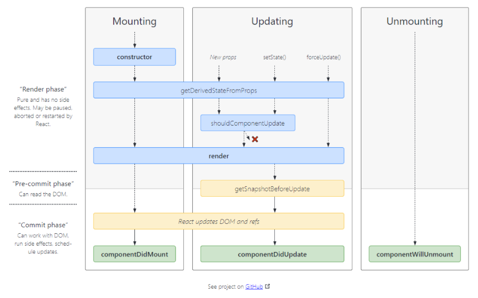

# 리액트의 생명주기 life-cycle에 대하여

## 개요

이번 포스트에서는 React 컴포넌트의 life-cycle에 대해 알아보겠습니다.
life-cycle(생명주기)는, 컴포넌트가 DOM위에 생성되기 전, 후 그리고 데이터가 변경되어 상태를 업데이트 하기 전, 후로 사용되는 메소드 들 입니다.
life-cycle에 대한 개념들은 React 개발을 함에 있어 반드시 짚고 넘어가야하는 부분 입니다.

## React LifeCycle Diagram



> react v17.0.0 이후부터는 componentWillMount, componentWillUpdate, componentWillReceiveProps 메소드가 deprecated 됩니다.

## 자세히 알아보기

React LifeCycle에서 주로 사용되는 메소드들은 아래 내용과 같습니다.

1. constructor
2. render
3. componentDidMount (Mount)
4. componentDidUpdate (Update)
5. componentWillUnmount (UnMount)

### Mount

1. constructor()

- 생성자 메소드로 컴포넌트가 처음 만들어 질 때 실행 됩니다.
- 이 메소드에서 state를 생성할 수 있습니다.

2. static getDerivedStateFromProps(nextProps, prevState)

- render() 메소드가 실행 되기 전에 실행하는 메소드 입니다.
- return type으로 Javascript Object를 주어야 된다. return 된 Object는 state에 반영됩니다.

3. render()

- 컴포넌트 렌더링을 담당합니다.

4. componentDidMount

- 이 메서드는 컴포넌트가 만들어지고 첫 렌더링을 마친 후 실행되는 메소드 입니다.
- 이 메서드에서 API 호출 및, setTimeout, setInterval 등의 처리를 담당합니다.

다음의 예제 코드를 실행하여, 실행 순서를 확인해보세요.

```js
import React from "react";

class Count extends React.Component{
    constructor() {
        super();
        this.state = {
          counter: 0,
        };
        console.log("1. constructor")
      }

      static getDerivedStateFromProps(nextProps, prevState){
        console.log("2. getDerivedStateFromProps");
      }
      componentDidMount(){
          console.log("4. componentDidMount");
      }

      ...
    render(){
        console.log("3. render")
        return(
           ...
        );
    }
}


export default Count;
```

그러면 다음과 같은 결과를 콘솔에서 확인할 수 있습니다.

```js
1. constructor
2. getDerivedStateFromProps
3. render
4. componentDidMount
```

### Update

1. static getDerivedStateFromProps(nextProps, prevState)

- Mount 단계와 동일

2. shouldComponentUpdate(nextProps, nextState)

- props혹은 state가 변경되었을때, 리 렌더링을 할지 말지 정하는 메소드 입니다.
- 실제로 사용할 때는 필요한 비교를 하고 값을 반환하도록 해야한다.

3. render()

- Mount 단계와 동일

4. getSnapshotBeforeUpdate

- Virtual DOM이 실제 DOM에 반영되기 직전에 실행된다.

5. componentDidUpdate

- 컴포넌트가 리렌더링을 마친 후 실행됩니다.

다음은 update단계에서 주로 사용되는 componentDidUpdate에 대한 예제 입니다.

```js
import React from "react";

class Count extends React.Component {
  constructor() {
    super();
    this.state = {
      counter: 0,
    };
  }
  componentDidMount() {
    console.log("component Did Mount");
  }

  //추가
  componentDidUpdate(prevProps, prevState) {
    if (this.state.counter !== prevState.counter) {
      console.log("componentDidUpdate");
    }
  }
  // counter +1
  increase = () => {
    this.setState({ counter: this.state.counter + 1 });
  };
  // counter -1
  decrease = () => {
    this.setState({ counter: this.state.counter - 1 });
  };
  render() {
    return (
      <div>
        <p>{this.state.counter}</p>
        <button onClick={this.increase}>+</button>
        <button onClick={this.decrease}>-</button>
      </div>
    );
  }
}

export default Count;
```

다음 코드를 실행하면 Mount 단계는 동일하게 진행되고, increase 및 decrease Button click을 했을때, state가 변경 되어, 다음과 같이 콘솔에 찍히는 모습을 확인할 수 있습니다.

```js
componentDidUpdate;
```

### UnMount

1. ComponentWillUnMount()

- 이 메서드는 DOM에서 컴포넌트가 지워진 후, 실행됩니다.
- 예를 들어 로그아웃 시, Component를 해제하기전에 사용자 세부정보와 모든 인증 토큰을 지우거나, setInterval을 clear할때 사용할 수 있습니다.

### 꼭 짚고 넘어가기!

LifeCycle에 대해 정확히 짚고 넘어가시면, 컴포넌트를 만들때, 도움이 될 것 입니다.

# 블로그 링크

> https://dlsgh120.tistory.com/39
