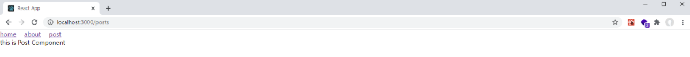

# react-router 간단히 사용해보기

## 개요

React 웹 어플리케이션을 개발할때, Client 사이드 라우팅을 위해 사용되는 리액트 라우터에 대해 알아보겠다.
라우팅에 대해 알아보기전 SPA(Single Page Application) 에 대한 개념을 짚고 넘어갈 필요가 있다.

## SPA(Single Page Application) 이란?

> 단일 페이지 어플리케이션(SPA)는 모던 웹 패러다임 이다. 기존의 웹사이트는 여러개의 html 파일로 구성되어 (a.html, b.html, c.html .....), 서버로 부터 요청하는 html 파일을 받아 화면에 구성되어있다. 또한, 페이지를 요청할때마다, 서버로 부터 받아오기 때문에, 페이지가 매번 새로고침 되었다.
> 이에 반면에 SPA는 한개의 HTML로 구성되어있다.
> 그리고, 한개의 페이지를 받아온 후, 서버에 요청을 하는 것이아닌, 새 페이지에 필요한 데이터만 받아와 화면을 구성하기에, 렌더링이 된다.

### SPA의 장점

1. VIEW 렌더링을 사용자 브라우저가 담당한다. 페이지 이동 시, 서버로부터 요청을 하지않아 서버의 부담을 줄일 수 있다.
2. 화면 전체를 렌더링 하는 것이 아닌, 필요한 부분만 받아 렌더링 하기 때문에 화면 전환이 빠르다.
3. 유저 입장에서 사용하기 편리하며, 더 좋은 경험을 제공.

### SPA 단점

1. 앱의 규모가 커질수록 javascript 파일이 커지며, javascript 파일을 불러오기전 까지, 로딩시간이 발생할 수 있음.
2. 또한, 한번에 파일을 불러오기 때문에, 필요하지 않는 데이터도 모두 불러오기 때문에 비효율적 이다.
   (Code Splitting -코드분할 로 파일을 분리 시켜, 필요한 파일만 불러 올 수 있음)
3. SEO(검색 엔진 최적화) 취약
   (javascript를 실행하지 않으면, 크롤링 불가능하며, 검색엔진의 결과에 나타나지 않을 수 있다.)

이와 같이 SPA의 개념 및 장단점에 대해 알아보았다.
이제 리액트로 SPA를 구현하기 위해, 다른 경로에 따른 화면을 보여주기 위한 라우팅에 대해 알아보자.

## Routing

라우팅이란 다른 경로(주소)에 따른 화면을 보여 주는 것 이다. 리액트 자체에는 이러한 라우팅 기능이 내장되어 있지않아, 가장 보편적인 react-router-dom을 추가하여 라우팅을 구현해야 한다.

라우팅 기능을 구현하기 위해 첫번째로 아래와 같이 react-router-dom 을 설치해야 한다.

```js
npm install react-router-dom --save
```

설치가 완료 되었으면, react-router-dom의 세부적인 기능에 대해 간단히 짚고 코드에 적용해 보자.

- **BrowserRouter** - HTML5의 history API를 이용하여 URL과 UI를 동기화 하는 라우터 이다.
- **Route** - 컴포넌트의 속성에 설정된 URL에 해당하는 컴포넌트를 렌더링 한다.
- **Link** - html의 a 태그와 비슷하다. Link가 a태그와 다른점은 href이 아닌 to 속성에 설정된 링크로 이동되며, 기록이 history 스택에 저장된다.
- **Switch** - path의 충돌이 일어나지 않게 Route들을 관리한다.
  Switch 내부에 Route들을 넣으면, 요청에 의해 매칭되는 Route 들이 다수 있을때, 제일 처음 매칭되는 Route만 선별하기 때문에 충돌 오류를 방지 해 준다.
  path와 매칭되는 Route가 없을때에 맨 밑 default 실행이 보장된다.

## react-router 적용하기

react-router-dom 설치가 완료 되었다면 준비는 끝났다.
이번 포스트에서 만들 라우터는 3가지다.

- **/** 경로일때, Home 컴포넌트를 보여준다.
- **/about** 경로일때, About 컴포넌트를 보여준다.
- **/posts** 경로일때, Post 컴포넌트를 보여준다.

다음과 같은 라우트 컴포넌트는 src/components 내부에 구성하였다.
또한, 라우트 컴포넌트를 만들기 전, 이동할 url을 화면으로 보여줄 Header컴포넌트를 만들어 보자.

#### src/components/Header

Header 컴포넌트는 다음과 같이 구성하였다.

```js
import React from "react";
import { Link } from "react-router-dom"; //추가

class Header extends React.Component {
  render() {
    return (
      <div>
        // 추가
        <Link to="/">home</Link>
        <Link to="/about">about</Link>
        <Link to="/posts">post</Link>
      </div>
    );
  }
}

export default Header;
```

react-router-dom의 기능인 Link를 이용하여, home, about, posts에 대한 경로로 이동을 하도록 만들어 보았다.

또한, 위의 경로로 이동하였을때 보여질, 라우트 컴포넌트를 만들어야 한다. 다음과 같이 간단하게 만들어보자.

#### src/components/Home

```js
import React from "react";

class Home extends React.Component {
  render() {
    return <div>this is Home Component</div>;
  }
}

export default Home;
```

Home 컴포넌트와 같이 About, Post 컴포넌트도 동일하게 만들어 준다.

## Router 적용

경로 이동을 위한 Header 컴포넌트에서 클릭되어 각 경로에 따라, 어떠한 라우트 컴포넌트를 보여 줄 것인지에 대한 정의를 해야한다.
App 컴포넌트에 다음과 같이 작성해 보자.

#### src/App

```js
import React from "react";
import { BrowserRouter, Switch, Route } from "react-router-dom"; //추가
import Header from "./components/Header";
import Home from "./components/Home"; //추가
import About from "./components/About"; //추가
import Post from "./components/Post"; //추가

class App extends React.Component {
  render() {
    return (
      // 추가
      <BrowserRouter>
        <Header /> //추가
        <Switch>
          <Route exact path="/" component={Home} />
          <Route path="/about" component={About} />
          <Route path="/posts" component={Post} />
        </Switch>
      </BrowserRouter>
    );
  }
}

export default App;
```

이제 react-router 기능이 간단하게 완성 되었다.
작성된 라우트가 제대로 작동하는지 확인해보자.

### url이 "/" 경로일때,


### url이 "/about" 경로일때,


### url이 "/posts" 경로일때,



위의 이미지와 동일하게 나왔다면, 라우트가 정상적으로 작동하고 있는 것 이다.
만약, Route에 설정된 경로가 아닌, 다른 경로로 접근하였다면, 어떤 결과가 나올까?
Swicth태그 밖에있는 Header 컴포넌트만 나오고, 어떠한 라우트 컴포넌트도 보이지 않고, 그냥 흰색 화면만 보일 것이다.
그래서 잘못된 경로로 접근되었을때, 보여질 화면인 notMatch 컴포넌트를 다음과 같이 만들어 보자.

### src/components/NotMatch

```js
import React from "react";

class NotMatch extends React.Component {
  render() {
    return (
      <div>
        <h1>404 NOT FOUND</h1>
        <p>잘못된 경로로 접근하였습니다. 주소를 확인해주세요.</p>
      </div>
    );
  }
}

export default NotMatch;
```

NotMatch 컴포넌트 작성이 완료되었다면, App 컴포넌트에서 다음과 같이 내용을 추가 한다.

```js
import React from "react";
import { BrowserRouter, Switch, Route } from "react-router-dom";
import Header from "./components/Header";
import Home from "./components/Home";
import About from "./components/About";
import Post from "./components/Post";
import NotMatch from "./components/NotMatch"; //추가

class App extends React.Component {
  render() {
    return (
      <BrowserRouter>
        <Header />
        <Switch>
          <Route exact path="/" component={Home} />
          <Route path="/about" component={About} />
          <Route path="/posts" component={Post} />
          <Route path="*" component={NotMatch} /> //추가
        </Switch>
      </BrowserRouter>
    );
  }
}

export default App;
```

추가가 완료 되었다면, "/", "/about", "/posts" 경로가 아닌 아무 경로를 입력해 보자. 나는 "/test" 라고 입력하였다.


위의 사진 내용과 동일하게 나온다면, 정상적으로 동작하는 것 이다.
path에 \*의 의미는 모든 라우트를 표시하는 와일드카드 기호이다. 그렇기에 "/"와 "/about" 그리고 "/posts"를 제외한 나머지라우트를 가르키는 것 이기에 다른 경로로 접근하였을 때, NotMatch 컴포넌트가 보이는 것이다.

### exact

이제 Home 라우트의 **exact**를 지워보신 후, 라우트가 작동하는 지 확인 해 보자.
모든 url 경로에서 Home 컴포넌트만 보여 질 것이다.
그 이유는 모든 Route의 path에 "/"가 있기 때문이다. 위에서 설명하였듯이, Route는 충돌이 일어나지 않게 하기 위해, 제일 첫 Route가 매칭 되기 때문에, 모든 경로에서 Home Component가 보이는 것 이다.
이러한 점을 잘 염두 해두어, 라우트 경로 관련하여 혼동이 없도록 설정 하면 된다.

# 블로그 링크

> https://dlsgh120.tistory.com/40
