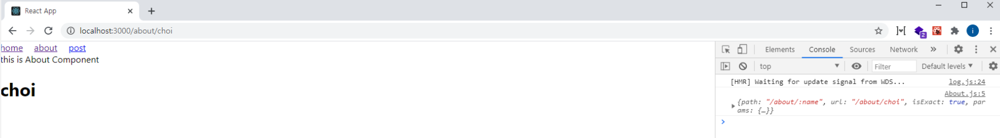

# react-router, 라우트 경로에 특정값을 넣어보기(params, query)

### 개요

이번 포스트는, 라우트 경로에 특정값을 넣는 방법에 대해 알아 보겠다.
라우트 경로에 특정값을 넣는 방법은 2가지가 있다. **params**를 사용하는 것, **query string**을 사용 하는 것 이다.

- params : /about/choi
- query : /about?name=inho

활용방식은 다양하지만, 주로 **params**는 특정 id 또는 이름 등을 가지고 조회할 때 사용되며,
**query**는 어떠한 키워드를 검색하거나 요청할때, 필요한 옵션을 전달할 때 사용된다.

### params

먼저 params의 사용법에 대해 알아보자.

```js
import React from "react";
import { BrowserRouter, Switch, Route } from "react-router-dom";
import Header from "./components/Header";
import Home from "./components/Home";
import About from "./components/About";
import Post from "./components/Post";
import NotMatch from "./components/NotMatch";

class App extends React.Component {
  render() {
    return (
      <BrowserRouter>
        <Header />
        <Switch>
          <Route exact path="/" component={Home} />
          <Route path="/about/" component={About} />
          <Route path="/about/:name" component={About} /> //추가
          <Route path="/posts" component={Post} />
          <Route path="*" component={NotMatch} />
        </Switch>
      </BrowserRouter>
    );
  }
}

export default App;
```

/:name 의 형식으로 설정을 하면, name 이라는 params가 생기며, 라우트 컴포넌트에서 match의 props를 전달 받게 된다.

변경이 완료 되었다면 About 컴포넌트를 다음과 같이 수정한다.

```js
import React from "react";

class About extends React.Component {
  render() {
    console.log(this.props.match); // 콘솔에서 확인해 보자.
    return (
      <div>
        this is About Component
        <h1>{this.props.match.params.name}</h1> //추가
      </div>
    );
  }
}

export default About;
```

App 컴포넌트에서 about 경로에 대한, name 이라는 params을 만들었고, 이 값은 **match.params.name**을 통하여 확인할 수 있다.
이제 /about/choi 경로로 접근해 보자.

뭔가 이상한 점이 있다.

바로, /about 이라는 라우트 경로에서 충돌이 발생하여, 맨위에 작성된 /about에 매핑이 되었다. 이 문제는, 이전 포스트에서 다루었듯이, **exact**로 해결하면 된다.

다음과 같이 나온다면 정상적으로 params이 작동하는 것 이다.


그럼 동일한 방법으로 params값을 한개 더 추가해보자.

App 컴포넌트를 다음과 같이 추가해보자.

```js
import React from "react";
...중복

class App extends React.Component{
  render(){
    return(
        <BrowserRouter>
            <Header />
            <Switch>
                <Route exact path="/" component={Home} />
                <Route exact path="/about/" component={About} />
                <Route exact path="/about/:name" component={About} />
                <Route path="/about/:name/:age" component={About} /> //추가
                <Route path="/posts" component={Post} />
                <Route path="*" component={NotMatch} />
            </Switch>
        </BrowserRouter>
    );
  }
}

export default App;
```

그리고 About컴포넌트도 :name과 같이, :age에 대한 내용을 추가하자.

```js
import React from "react";

class About extends React.Component {
  render() {
    console.log(this.props.match); // 콘솔에서 확인해보자.
    return (
      <div>
        this is About Component
        <h1>{this.props.match.params.name}</h1>
        <h1>{this.props.match.params.age}</h1> //추가
      </div>
    );
  }
}

export default About;
```

그리고 경로를 /about/choi/27로 접근해 보면,
name과 age값이 잘 나오는 것을 확인할 수 있다.

이렇게 라우트에 특정값을 넣는 방법 중 하나인 params에 대해 알아보았다.

### query

이제 다른 방법인 **query**에 대해 알아보자.
params 방식은, 라우트 컴포넌트에 match에 대한 props를 전달하였고, query는 라우트 컴포넌트에 location에 대한 props를 전달한다.

다음과 같이 About 컴포넌트를 변경해보자.

```js
import React from "react";

class About extends React.Component {
  render() {
    console.log(this.props.location.search); //추가
    return <div>... 동일</div>;
  }
}

export default About;
```

이제 /about?name=choi 로 접근을 하여, 콘솔을 하면,
다음과 같이 출력이 되어 있을 것이다.

```js
?name=choi
```

여기서 문제점이 있다. props로 전달받은 location.search 값은, 하나의 문자열로 되어 있어, 이 데이터를 가지고 검색 등에 대한 활용을 할 수 없다.
그래서 이 쿼리의 문자열을 파싱하여 하나의 객체로 만들어야 한다.

쿼리의 해석을 하기 위해, 다음과 같이 라이브러리를 설치하시면, 아주 쉽게 해결할 수 있다.

```js
npm install query-string
```

설치가 완료 되었으면 About 컴포넌트를 다음과 같이 수정해보자.

```js
import React from "react";
import queryString from "query-string"; //추가

class About extends React.Component{
    render(){
        const query = queryString.parse(this.props.location.search); //추가
        console.log(query); //추가
        return(
            ... 동일
        );
    }
}

export default About;
```

그리고 동일한 /about?name=choi 로 접근 후, 콘솔을 확인 해보자.

```js
{
  name: choi;
}
```

위와 같이 출력이 되었다면, 정상적으로 문자열인 쿼리를 하나의 객체로 파싱 된 것 이다.

마지막으로 params과 query를 같이 사용한 예제를 보도록 하자.

##### src/components/About

```js
import React from "react";
import queryString from "query-string";

class About extends React.Component {
  render() {
    const query = queryString.parse(this.props.location.search);
    console.log(query);
    return (
      <div>
        this is About Component
        <h1>{this.props.match.params.name}</h1>
        <h1>{this.props.match.params.age}</h1>
        //추가
        {query.detail === "true" && (
          <div>
            <p>주소: 서울특별시</p>
            <p>Phone: 010-0000-0000</p>
          </div>
        )}
      </div>
    );
  }
}

export default About;
```

작성이 완료 되었다면, /about/choi/27?detail=true로 접근해 보자.
query를 활용해, detail 값이 true 일때, 추가 정보를 보여주도록 하였다.

> 여기서 **주의** 해야 할 점은 모든 URL query는 string 타입 이다.

예를 들면, ?detail=true에서 true는 boolean 타입이 아닌, string 타입 이다. 따라서, 비교를 수행할 때, 타입을 알맞은 형태로 변환 시킨 후 비교를 해야 한다.

### 마치며

이번 포스트에서는 react-router 기능을 수행할때, 라우터에 특정 값을 추가하는 방법인 params 및 query에 대해 알아보았다.

참고 : [https://velopert.com/3417](https://velopert.com/3417)

# 블로그 링크

> https://dlsgh120.tistory.com/41
