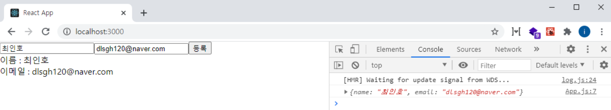

# Input 상태 관리하기

### 개요

이번 포스트에서는 React 컴포넌트의 Form에 발생하는 사용자 입력값을 제어 하는 방법을 알아보겠다.

### 단일 Input 제어

다음과 같이, src/components/FormInput.js 파일을 만들어 컴포넌트를 생성해보자.

```
import React from "react";

class FormInput extends React.Component{
    state = {
        name:""
    }
    render(){
        return(
            <form>
                <input type="text"
                    value={this.state.name}
                />
                <div>
                    {this.state.name}
                </div>
            </form>
        );
    }
}

export default FormInput;
```

작성이 완료되었다면, 터미널에 **npm start**를 입력하여, 프로젝트를 실행 하자.  
그리고 App 컴포넌트에서, FormInput을 렌더링 시켜보자.

프로젝트 실행을 하였다면, 인풋창에, 값을 입력해보자.

무언가 이상할 것 이다.
값을 입력 하고도 변경되지 않는다면, 정상이다.

state를 확인해보면, 렌더링 되기전에 name이라는 이름의 빈 값을 초기화 하였다.  
또한, input 태그의 value에 this.state.name 값으로 초기화를 하였기 때문에, 빈 인풋 창만 나올 것이다.

그러면, 변경을 시킬려면 어떻게 해야 할까?  
어렵지 않다.

다음과 같이 코드를 추가해 보자.

```
import React from "react";

class FormInput extends React.Component{
    state = {
        name:""
    }

    //추가
    changeHandler = (e) =>{
           this.setState({name:e.target.value});
    }
    render(){
        return(
            <form>
                <input type="text"
                    value={this.state.name}
                    placeholder="이름을 입력하세요."
                    onChange={this.changeHandler} //추가
                />
                <div>
                    입력 값: {this.state.name}
                </div>
            </form>
        );
    }
}

export default FormInput;
```

다음과 같이 코드가 추가 되었다면, 인풋 창에 텍스트를 입력해보자.  
정상적으로 변경되는 것을 확인 하실 수 있다.

그러면 추가된 내용에 대해 자세히 알아보겠다.

텍스트를 변경하기 위해 onChange 이벤트를 발생 시켜야 한다.  
또한, onChange 이벤트가 발생 되었을때, changeHandler 함수가 실행되며, 이벤트 객체인 **e**를 파라미터로 받아 온다.

이 **e** 객체의 e.target은 input DOM을 가르키고, value는 그 input DOM의 값을 의미한다.  
그래서 onChange 이벤트가 발생하여, 값이 변경 될때, input 의 값을 this.setState를 통해 관리(변경) 해 주면 된다.

### 다중 입력 제어

만약 input이 여러개 일때는 어떻게 해야 할까?  
다음 과 같이 코드를 작성해 보자.

```
import React from "react";

class FormInput extends React.Component{
    state = {
        name:"",
        email:""
    }

    changeHandler = (e) =>{
        this.setState({[e.target.name]:e.target.value})
    }
    render(){
        return(
            <form>
                <input type="text"
                    value={this.state.name}
                    placeholder="이름을 입력하세요."
                    onChange={this.changeHandler}
                    name="name"
                />
                <input type="text"
                    value={this.state.email}
                    placeholder="이메일을 입력하세요."
                    onChange={this.changeHandler}
                    name="email"
                />

                <div>
                    이름 : {this.state.name}<br />
                    이메일 : {this.state.email}
                </div>
            </form>
        );
    }
}

export default FormInput;
```

작성이 완료되었다면, 브라우저로 확인해보자.

아마도, 다음 코드와 같이, 각 인풋마다 다른 이벤트 핸들러 함수를 만들고자 하는 사람이 있을 수 도 있다.

```
import React from "react";

class FormInput extends React.Component{
    state = {
        name:"",
        email:""
    }

    changeNameHandler = (e) =>{
           this.setState({name: e.target.value});
    }
    changeEmailHandler = (e) =>{
        this.setState({email: e.target.value});
    }
    render(){
        return(
            <form>
                <input type="text"
                    value={this.state.name}
                    placeholder="이름을 입력하세요."
                    onChange={this.changeNameHandler}
                />
                <input type="text"
                    value={this.state.email}
                    placeholder="이메일을 입력하세요."
                    onChange={this.changeEmailHandler}
                />

                <div>
                    이름 : {this.state.name}<br />
                    이메일 : {this.state.email}
                </div>
            </form>
        );
    }
}

export default FormInput;
```

이 코드도 위의 코드와 같이 동일하게 잘 작동은 할 것이다.  
하지만 만약 회원가입 form과 같이 여러개의 input이 필요하다고 생각해자.
이메일, 패스워드, 패스워드 중복확인, 휴대폰, 주소 등 여러개의 인풋에 따라 각각의 이벤트 핸들러 함수를 만들어야 할 것이다.

그렇기에, 모든 input의 change 이벤트 핸들러는, 각각의 이벤트 핸들러를 만드는 방법이 아닌, 첫번째 방법으로 하나의 이벤트 핸들러를 만들어, 변경 한다.

하나의 이벤트 핸들러를 만들어 처리를 할때는, input을 구분하기 위해, 각 input에 대해 name 값을 부여 해줘야 한다.

이 name 값은 e.target.name을 통해 조회할 수 있다.

### 부모 컴포넌트에 전달

변경되는 각 input의 값에 대해 부모 컴포넌트에 전달해 줄 수 있다.  
부모 컴퍼넌트에 전달하기 전 각 input의 state값이 제대로 나오는지, button을 만들어 다음과 같이 확인해 보겠다.

#### src/components/FormInput

```
import React from "react";

class FormInput extends React.Component{
    state = {
        name:"",
        email:""
    }

    changeHandler = (e) =>{
        this.setState({[e.target.name]:e.target.value})
    }

    // 추가
    submitHandler = () =>{
        console.log(this.state.name, this.state.email);
    }
    render(){
        return(
            <form onSubmit={this.submitHandler}>
                <input type="text"
                    value={this.state.name}
                    placeholder="이름을 입력하세요."
                    onChange={this.changeHandler}
                    name="name"
                />
                <input type="text"
                    value={this.state.email}
                    placeholder="이메일을 입력하세요."
                    onChange={this.changeHandler}
                    name="email"
                />
                <button type="submit">등록</button> //추가
                <div>
                    이름 : {this.state.name}<br />
                    이메일 : {this.state.email}
                </div>
            </form>
        );
    }
}

export default FormInput;
```

다음과 같이 코드 작성이 완료 되었다면, input에 텍스트를 입력 후, 버튼을 클릭해보자.

그러면, 현재 경로 뒤에 ?name=asd&email=asd 이런식으로 경로가 이동 후, 새로고침이 일어날 것이다.

이러한 문제를 해결하기 위해, submit 이벤트가 일어날때, e.preventDefault()라는 함수를 호출하며, 경로가 이동되는 것을 막아줘야 한다.

다음과 같이 추가해보자.

```
import React from "react";

class FormInput extends React.Component{
    state = {
        name:"",
        email:""
    }

    changeHandler = (e) =>{
        this.setState({[e.target.name]:e.target.value})
    }

    //변경
    submitHandler = (e) =>{
        e.preventDefault(); //추가
        console.log(this.state.name, this.state.email);
    }
    render(){
        return(
           // ...동일
        );
    }
}

export default FormInput;
```

e.preventDefault() 함수를 추가하였다면, 다시한번 브라우저에서 확인해 보자.
경로 변경 및 새로고침이 일어나지 않고, 제대로 console로 찍히는 모습을 확인할 수 있다.

이제 부모 컴포넌트로 input의 state값을 전달하는 방법을 알아보자.  
첫번째로, FormInput의 부모 컴포넌트인 App 컴포넌트에 다음과 같이 변경해보자.

#### src/App

```
import React from "react";
import FormInput from "./components/FormInput";

class App extends React.Component{

  // 추가
  createHandler = (userData) =>{
      console.log(userData);
  }
  render(){
    return(
      <div className="App">
        <FormInput createHandler={this.createHandler}/> //변경
    );
  }
}

export default App;
```

작성이 완료 되었다면, FormInput 컴포넌트에서 onSubmit 이벤트를 설정 한다.

```
import React from "react";

class FormInput extends React.Component{
    state = {
        name:"",
        email:""
    }

    changeHandler = (e) =>{
        this.setState({[e.target.name]:e.target.value})
    }

    submitHandler = (e) =>{
        e.preventDefault();
        this.props.createHandler(this.state); //추가
    }
    render(){
        return(
            <form onSubmit={this.submitHandler}>
                <input type="text"
                    value={this.state.name}
                    placeholder="이름을 입력하세요."
                    onChange={this.changeHandler}
                    name="name"
                />
                <input type="text"
                    value={this.state.email}
                    placeholder="이메일을 입력하세요."
                    onChange={this.changeHandler}
                    name="email"
                />
                <button type="submit">등록</button>
                <div>
                    이름 : {this.state.name}<br />
                    이메일 : {this.state.email}
                </div>
            </form>
        );
    }
}

export default FormInput;
```

부모컴포넌트로 부터 전달받은 createHandler 함수를 호출할때, state값을 전달 하였다.

이제 제대로 작동하는지 확인해보자.



위 이미지와 같이 나온다면, 잘 작동 하는 것 이다.

### 마치며

각 input에 대한 onChange 이벤트 핸들러가 발생할때, **e** 라는 이벤트 객체를 가지고 어떻게 처리하는지에 대해 까먹지 않았는지 꼭 짚고 넘어갈 필요가 있다.

# 블로그 링크

> https://dlsgh120.tistory.com/41
