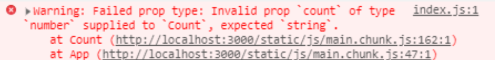

# 동적 컴포넌트를 위한 필수요소 Props와 State에 관하여

## 개요

이번 포스트에서는 React의 동적 컴포넌트를 위한 필수요소인 Props와 State에 대해 알아보겠습니다.

## Props

리액트에서 다루는 데이터는 크게 Props와 State 두개로 나뉩니다. 여기서 props에 대해서 상세하게 알아보도록 하겠습니다.
props는 부모 컴포넌트가 자식 컴포넌트에게 전달하는 값 입니다. 자식 컴포토넌트에서는 props값을 받아와, 이를 처리 하도록 합니다. 또한, 부모 컴포넌트에서 전달하는 props 값이 바뀐다면 자동으로 업데이트 됩니다.

예제를 통해 props에 대해 자세히 알아보겠습니다.
이전포스트에서 설치한 React 폴더 보면 src 디렉터리가 있습니다. 이 src 디렉터리에 components 폴더를 추가한 뒤, Count.js 파일을 만든 후, Count 컴포넌트를 추가하도록 하겠습니다.

Count.js 파일을 생성하셨다면, 다음과 같이 코드를 작성하겠습니다.

```js
import React from "react";

class Count extends React.Component {
  render() {
    return (
      <div>
        <p>{this.props.count}</p>
      </div>
    );
  }
}

export default Count;
```

Count.js 파일에 작성된 코드에서 {this.props.count}를 자세히 봐야할 부분입니다.

this.props.count는 부모컴포넌트로 부터 받아온 count라는 값입니다. 여기서 부모 컴포넌트는 App.js 파일이며, 부모 컴포넌트로 부터 count값을 전달 해 줘야합니다.

App.js 코드를 다음과 같이 수정이 필요합니다.

```js
import React from "react";
import Count from "./components/Count";

class App extends React.Component {
  render() {
    return <Count count={1} />;
  }
}

export default App;
```

이렇게 Count라는 자식 컴포넌트에 count라는 이름의 1의 값을 전달 한 것을 볼 수 있습니다.
화면에 1이라고 출려되면 정상적으로 props값을 출력한 것을 볼 수 있습니다.

## defaultProps

부모 컴포넌트에서 자식컴포넌트로 props값을 전달하는 방식과 다른 defaultProps에 대해서 알아보겠습니다.
defaultProps는 특정한 상황에 props를 비워둬야 하는 경우가 있습니다. 이러한 경우에 props의 기본값을 설정해 줄 수 있습니다.
아래의 코드를 보며 자세히 알아보겠습니다.

```js
import React from "react";

class Count extends React.Component {
  static defaultProps = {
    title: "hello world!",
  };
  render() {
    return (
      <div>
        <p>{this.props.count}</p>
        <p>{this.props.title}</p>
      </div>
    );
  }
}

export default Count;
```

코드를 확인해 보시면, Count.js 파일에서 this.props.title이 추가 되었습니다. 이는 부모컴포넌트인 App.js에서 전달된 props값이 아닌, Count.js파일에 작성된 defaultProps에 작성된 값이 적용 되었습니다.
화면에 1과, hello world! 라고 출력되었으면, 정상적으로 동작을 하고 있다는 의미 입니다.

## propTypes

propsTypes를 이용하여, 부모 컴포넌트로부터 전달받은 props의 타입과 일치한지 검사를 수행합니다. 이 수행과정은 타입이 일치하지 않아서 발생하는 문제를 찾을 수 있습니다.
이 propTypes을 사용하기 위해서는 props-types이라는 패키지를 설치해야 합니다.
다음과 같이 설치를 진행하겠습니다.

```js
npm install prop-types
```

설치가 완료되었으면, 다음 예제 코드를 확인해주세요.

```js
import React from "react";
import propTypes from "prop-types"; //추가

class Count extends React.Component {
  static defaultProps = {
    title: "hello world!",
  };
  render() {
    return (
      <div>
        <p>{this.props.count}</p>
        <p>{this.props.title}</p>
      </div>
    );
  }
}

//추가
Count.propTypes = {
  count: propTypes.number.isRequired,
  title: propTypes.string.isRequired,
};
export default Count;
```

이러한 방식으로, props의 타입 검사가 진행 됩니다.
만약 count:propTypes.**string**.isRequired 으로 작성하여 타입을 맞지 않게 했을 경우 다음과 같은 에러가 발생함을 확인할 수 있습니다.



## State

state는 동적인 데이터를 다룰때 사용됩니다. state는 컴포넌트가 만들어질 때, 가장 먼저 설정되는 것이기 때문에 constructor 안에 적어 줍니다.
다음 Count.js 파일의 코드를 봐주세요.

```js
import React from "react";

class Count extends React.Component {
  constructor(props) {
    super(props);
    this.state = {
      counter: 0,
    };
  }
  // 1씩 더하는 기능
  increase = () => {
    this.setState({ counter: this.state.counter + 1 });
  };
  // 1씩 감소하는 기능
  decrease = () => {
    this.setState({ counter: this.state.counter - 1 });
  };
  render() {
    return (
      <div>
        <p>{this.state.counter}</p>
        <button onClick={this.increase}>+</button>
        <button onClick={this.decrease}>-</button>
      </div>
    );
  }
}

export default Count;
```

처음 counter 이라는 state로 선언하고, 0으로 초기화 시켰습니다.
이전에도 말했듯이, state값은 동적으로 변화가 가능한 데이터 이기 때문에, 값을 변경 시킬 수 있습니다.
counter의 값이 1씩 더해지는 기능인 increase 함수와, 1씩 감소하는 기능인 decrease 함수를 만들어 주었습니다.
여기서 주의해서 보아야 할 내용은 this.setState 입니다.
this.setState 기능으로 state값을 동적으로 변화를 시켜 줄 수 있습니다.

이제 이번 포스팅의 마무리가 되어 갑니다.
마지막으로 설명드릴 내용은 State 값 및, State값을 동적으로 변화 시켜주는 increase, decrease도 props로 전달이 가능 합니다.

간단한 예제로 확인해 보겠습니다.

부모 컴포넌트인 App.js 파일 입니다.

```js
import React from "react";
import Count from "./components/Count";

class App extends React.Component {
  constructor(props) {
    super(props);
    this.state = {
      counter: 0,
    };
  }

  // counter +1
  increase = () => {
    this.setState({ counter: this.state.counter + 1 });
  };

  // counter -1
  decrease = () => {
    this.setState({ counter: this.state.counter - 1 });
  };
  render() {
    return (
      <Count
        counter={this.state.counter}
        increase={this.increase}
        decrease={this.decrease}
      />
    );
  }
}

export default App;
```

App 이라는 부모 컴포넌트에서 Counter 이라는 자식컴포넌트에게 counter(state), increase(function), decrease(function)를 props전달 합니다.

자식 컴포넌트인 Counter.js 파일입니다.

```js
import React from "react";
import propTypes from "prop-types";

class Count extends React.Component {
  render() {
    return (
      <div>
        <p>{this.props.counter}</p>
        <button onClick={this.props.increase}>+</button>
        <button onClick={this.props.decrease}>-</button>
      </div>
    );
  }
}

Count.propTypes = {
  counter: propTypes.number.isRequired,
  increase: propTypes.func.isRequired,
  decrease: propTypes.func.isRequired,
};

export default Count;
```

이러한 방식으로, 부모 컴포넌트로 부터 counter(state), increase(function), decrease(function) 전달 받아 사용할 수 있습니다,

# 블로그 링크

> https://dlsgh120.tistory.com/37
