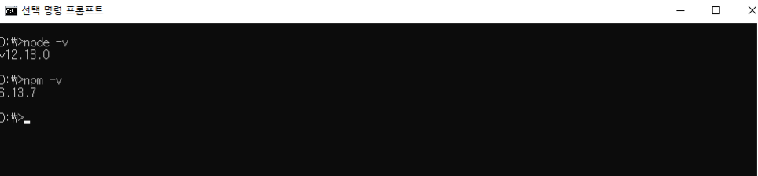
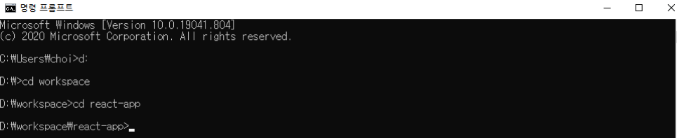
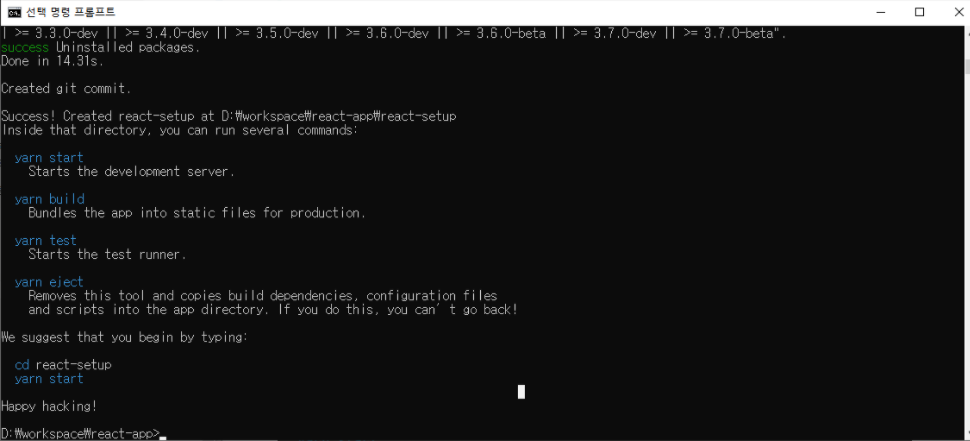
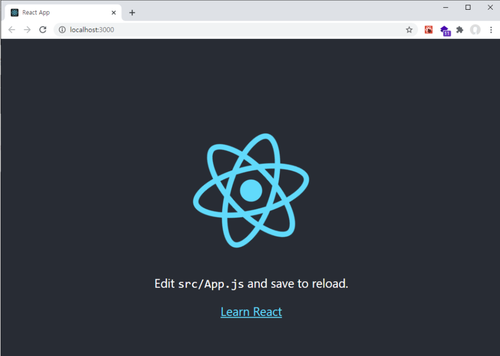

# creact-react-app 으로 리액트 앱 생성 및 실행

## 개요

이전 포스트에서는 React의 개념 및 주요 특징에 대해서 설명하였습니다. 이번 포스트에서는 React project를 생성하고 실행하는 법에 대해서 알아보겠습니다.

## create-react-app 이란?

React 프로젝트 개발환경 구축을 처음부터 설정하는 것은 굉장히 복잡합니다. 직접 개발 환경을 구축하기 위해서는 웹팩(webpack)에 대한 공부를 해야합니다. 하지만 웹팩으로 구성이 아닌 create-react-app 으로 설치를 한다면 아주 간단히 세팅을 할수 있습니다.

create-react-app은 **페이스북** 에서 만든 공식적인 React 웹 개발용 보일러플레이트(Boilerplate) 입니다. 직접 모든 개발환경을 설정하지 않아도 되며, 페이스북에서 지속적으로 업데이트를 해주기 때문에, 많이 사용 되고 있습니다.

## 준비사항

1. node.js 및 npm 설치

웹팩(webpack), 바벨(babel)과 같은 도구들이 자바스크립트 런타임인 Node.js를 기반으로 만들어 져있기때문에 해당 도구들을 사용하기 위해서 node.js를 설치해야합니다.

**node.js**와 **npm** 설치는 간단합니다. npm의 경우는 Node Package Manager 이기 때문에, node.js를 설치하면 같이 설치 됩니다.
링크 : [https://nodejs.org/ko/](https://nodejs.org/ko/)

설치가 완료 되었다면 설치가 재대로 되었는지 명령 프롬프트를 실행하여 확인 하실 수 있습니다.

```js
node - v;
```

node.js가 정상적으로 설치 되었다면, npm도 설치가 되었겠지만, 그래도 확인합니다.

```js
npm - v;
```

다음과 같이 버전이 제대로 나온다면, 정상적으로 설치가 완료 되었습니다.



2. Code Editor 설치

코드 에디터는 VSCode, Atom, WebStorm, Brackets 등이 있지만 주로 VSCode를 사용합니다.
링크 : [https://code.visualstudio.com/](https://code.visualstudio.com/)

## create-react-app 설치

Node.js, Npm, VSCode의 설치가 완료 되었으면 React 프로젝트를 간단히 설치 할수 있습니다.

첫번째로, CMD 및 VSCode 의 터미널로 가셔서, 설치하실 디렉터리로 가셔야 합니다.
저는 다음과 같은 경로에 설치를 진행 하였습니다.



```js
npx create-react-app project_name
```

npx는 npm 패키지를 로컬에 글로벌로 설치하지 않고 일회성으로 실행할 수 있게 해주는 도구 입니다. npm 5.2.0 이후의 버전부터 제공됩니다.

npx가 실행 되지 않는 경우는 아래와 같이 설치를 진행 합니다.

```js
npm install -g create-react-app
create-react-app project_name
```

설치가 완료되었다면, 다음과 같은 결과가 나옵니다.



이제, React app을 실행하기위해 다음과 같이 경로 이동후, npm 실행 명령어를 입력하시면 정상적으로 실행 됨을 볼수 있습니다.

```js
cd project_nm
npm start
```

이 화면이 나온다면 정상적으로 React App설치가 완료 되었다는 뜻입니다. 만약 이 화면이 나오지 않는다면, 브라우저에서 http://localhost:3000로 접근하시면 확인 하실 수 있습니다!



오늘은 이렇게 간단하게 React Project를 설치 및 실행하는 법에 대해 알아 보았습니다.
읽어 주셔서 감사합니다. Happy Hacking!

# 블로그 링크

> https://dlsgh120.tistory.com/36
